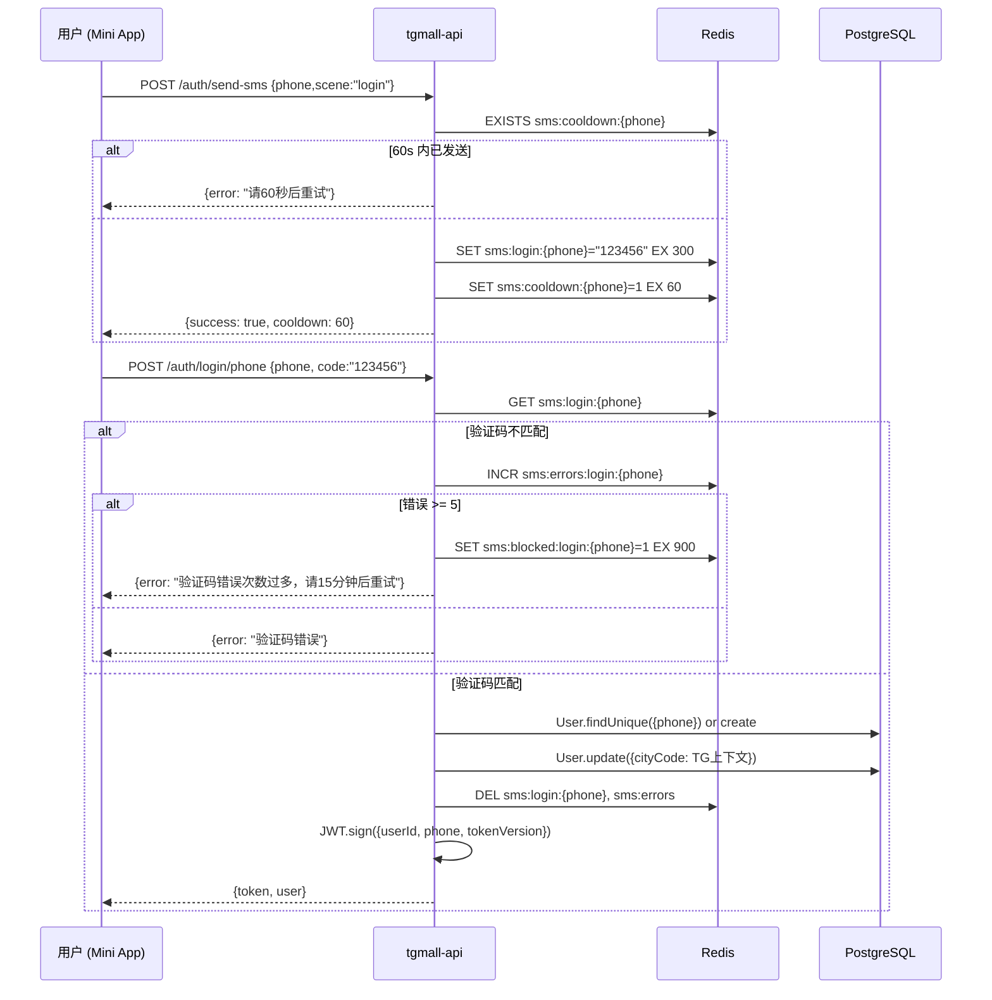
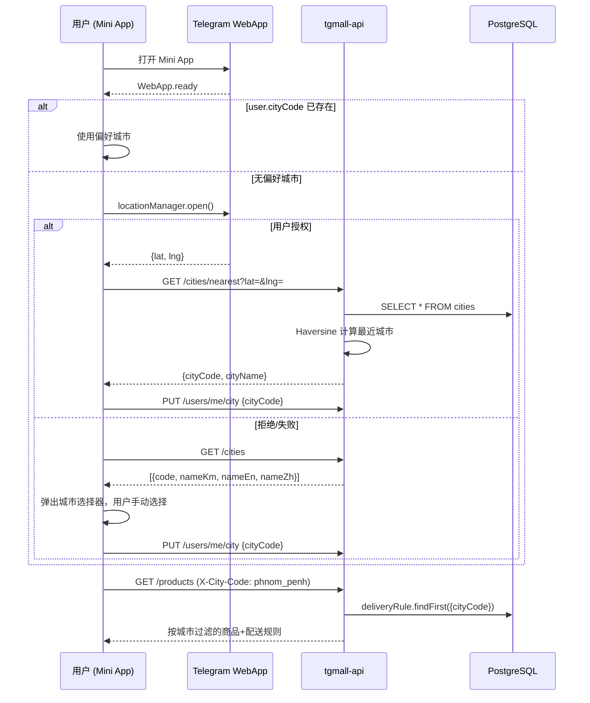

# Sprint 6：手机号登录 + 城市体验 — 设计文档

> **文档版本**：V1.0
> **编制日期**：2026-07-03
> **对应 PRD**：项目文档/产品需求文档_PRD.md V2.1
> **对应 Backlog**：S1-21 手机号登录体系、S1-22 忘记密码、S5-05 城市定位

## 1. 目标

Sprint 6 新增两条能力线：

| 能力线 | 交付物 | 估点 |
|--------|--------|------|
| **手机号认证** | SMS 验证码登录、密码注册/登录、忘记密码重置 | 8 + 3 SP |
| **城市体验** | GPS 定位授权 → 城市检测 → 城市切换联动配送规则 | 3 + 2 SP |

## 2. 关键决策

| 决策 | 选择 |
|------|------|
| SMS 服务商 | 开发阶段 Mock（固定 `123456`），生产再接入 Twilio |
| 账户模型 | 统一账户 — Telegram 登录与手机号登录共用同一 User 记录 |
| 城市定位 | Telegram WebApp.location API（GPS 授权 + 反向地理编码） |

## 3. 数据库变更

### 3.1 User 表扩展

```prisma
model User {
  // …现有字段: id, telegramId, firstName, lastName, username, language, status, createdAt, updatedAt
  phone          String?            @unique @db.VarChar(20)
  passwordHash   String?            @map("password_hash") @db.VarChar(255)
  tokenVersion   Int                @default(0) @map("token_version")
  cityCode       String?            @map("city_code") @db.VarChar(50)
  city           City?              @relation(fields: [cityCode], references: [code])
  passwordHistory PasswordHistory[]
}
```

### 3.2 PasswordHistory 新表

```prisma
model PasswordHistory {
  id        Int      @id @default(autoincrement())
  userId    String   @map("user_id") @db.Uuid
  hash      String   @db.VarChar(255)
  createdAt DateTime @default(now()) @map("created_at")
  user      User     @relation(fields: [userId], references: [id], onDelete: Cascade)

  @@index([userId, createdAt])
}
```

### 3.3 City 表扩展

City 表已存在，新增 `lat`/`lng` 字段用于反向地理编码：

```prisma
model City {
  // …现有字段
  lat    Float?    // 纬度
  lng    Float?    // 经度
}
```

### 3.4 City 种子数据

```
code         name_km            name_en           name_zh     lat      lng       status
phnom_penh    ភ្នំពេញ            Phnom Penh        金边         11.562   104.889   active
siem_reap     សៀមរាប            Siem Reap         暹粒         13.363   103.856   active
sihanoukville ក្រុងព្រះសីហនុ    Sihanoukville     西哈努克     10.625   103.523   active
battambang    បាត់ដំបង          Battambang        马德望       13.096   103.202   inactive
```

## 4. API 设计

### 4.1 手机号认证

| 方法 | 路径 | 请求体 | 响应 | 鉴权 |
|------|------|--------|------|------|
| POST | `/auth/send-sms` | `{ phone, scene }` | `{ success, cooldown }` | 无 |
| POST | `/auth/login/phone` | `{ phone, code?, password? }` | `{ token, user }` | 无 |
| POST | `/auth/set-password` | `{ password }` | `{ success }` | auth |
| POST | `/auth/reset-password` | `{ phone, code, newPassword }` | `{ success }` | 无 |
| POST | `/auth/bind-phone` | `{ phone, code }` | `{ user }` | auth |

**验证码发送流程（Mock）：**

1. 校验手机号格式：`/^\+855[1-9]\d{7,8}$/`
2. 60 秒冷却检测：`sms:cooldown:{phone}` (Redis, TTL=60s)
3. 生成 Mock 验证码 → `"123456"`
4. 存储：`sms:{scene}:{phone}` = `"123456"` (Redis, TTL=300s)
5. 错误计数器初始化：`sms:errors:{scene}:{phone}` = 0

**验证码登录流程：**

1. 从 Redis 获取 `sms:login:{phone}`
2. 比对验证码 → 不匹配时 `sms:errors:login:{phone}` +1
3. 连续 5 次错误 → `sms:blocked:login:{phone}` (TTL=900s)
4. 匹配成功 → 删除 SMS key 和错误计数器
5. 用户不存在 → 自动创建 `User({ phone })`
6. JWT 签发（含 `tokenVersion`）

**密码登录流程：**

1. 查询 `User.findUnique({ phone })`
2. 未注册 → `该手机号未注册，请先验证码登录`
3. `bcrypt.compare(password, user.passwordHash)` → 不匹配则拒绝
4. JWT 签发

**设置密码：**

1. auth 中间件 → `req.user.id`
2. 校验密码复杂度：8-20 位，至少包含字母和数字
3. `bcrypt.hash(password, 10)` → `user.passwordHash`
4. 写入 `passwordHistory`

**忘记密码重置：**

1. 校验 `sms:reset_password:{phone}` = code
2. 密码复杂度校验 + 不与最近 3 条 `passwordHistory` 重复
3. `user.passwordHash` = bcrypt hash
4. `user.tokenVersion += 1`（所有终端 JWT 失效）
5. 删除 SMS key

### 4.2 城市定位与切换

| 方法 | 路径 | 说明 | 鉴权 |
|------|------|------|------|
| GET | `/cities` | 城市列表（用于选择器） | 无 |
| GET | `/cities/nearest?lat=&lng=` | 根据坐标匹配最近城市（Haversine） | 无 |
| PUT | `/users/me/city` | 更新用户偏好城市 | auth |

**反向地理编码算法：**

```
const CITIES = [{ code, lat, lng }, ...]  // 从 DB 读或硬编码缓存

function findNearestCity(lat, lng) {
  let nearest = null, minDist = Infinity
  for (const city of CITIES) {
    const dist = haversine(lat, lng, city.lat, city.lng)
    if (dist < minDist) { minDist = dist; nearest = city }
  }
  return minDist <= 50 ? nearest : null  // 50km 阈值
}
```

**城市切换联动：**

1. 用户切换城市 → `PUT /users/me/city { cityCode }`
2. 前端请求自动附带 `X-City-Code` header
3. 首页按城市过滤商品、起送金额、配送费
4. 购物车保留当前城市上下文

### 4.3 JWT Payload 扩展

```json
{
  "userId": "uuid",
  "telegramId": "123456",
  "phone": "+85512345678",
  "role": "user",
  "tokenVersion": 1,
  "iat": 1234567890,
  "exp": 1234567890
}
```

## 5. 文件清单

| 操作 | 文件 | 说明 |
|------|------|------|
| 创建 | `src/services/sms.service.js` | SMS Mock 发送/校验 |
| 修改 | `src/services/auth.service.js` | 新增手机号登录/注册/密码重置 |
| 创建 | `src/services/city.service.js` | 城市列表 + Haversine 最近匹配 |
| 修改 | `src/controllers/auth.controller.js` | 新增 sendSms / loginPhone / setPassword / resetPassword / bindPhone |
| 创建 | `src/controllers/city.controller.js` | listCities / nearestCity |
| 修改 | `src/routes/auth.routes.js` | 新增 5 条路由 |
| 创建 | `src/routes/city.routes.js` | GET /cities, GET /cities/nearest |
| 修改 | `src/validators/auth.schema.js` | 新增 sendSms / loginPhone / resetPassword / setPassword schemas |
| 修改 | `src/services/order.service.js` | 集成城市配送规则（已有城市校验逻辑，添加 X-City-Code header） |
| 修改 | `src/middleware/auth.js` | JWT 验证加入 tokenVersion 校验 |
| 创建 | `tests/unit/sms-service.test.js` | SMS Mock 逻辑测试 |
| 创建 | `tests/unit/city-service.test.js` | Haversine + 城市查询测试 |
| 修改 | `tests/unit/auth-service.test.js` | 手机号登录/密码重置测试 |
| 修改 | `prisma/schema.prisma` | User + PasswordHistory + City 字段 |
| 修改 | `prisma/seed.js` | City 种子数据（含坐标） |
| 创建 | `tgmall-mini-app/src/pages/LoginPage.vue` | 短信/密码双 Tab 登录 |
| 创建 | `tgmall-mini-app/src/pages/ResetPasswordPage.vue` | 忘记密码流程 |
| 创建 | `tgmall-mini-app/src/components/CityPicker.vue` | 城市选择弹窗 |
| 修改 | `tgmall-mini-app/src/pages/HomePage.vue` | 顶部城市选择器 + 定位引导 |
| 修改 | `tgmall-mini-app/src/pages/ProfilePage.vue` | 手机号绑定入口 |
| 修改 | `tgmall-mini-app/src/locales/{km,en,zh}.json` | 新增登录/城市相关 i18n key |

## 6. Mermaid 序列图

### 6.1 SMS 登录



### 6.2 城市定位与切换



## 7. 安全注意事项

- 验证码 5 分钟过期，错误 5 次锁定 15 分钟
- 密码 bcrypt salt rounds = 10
- 密码历史 3 条防重复使用
- tokenVersion 机制：重置密码后所有 JWT 失效
- 手机号格式严格校验：`^\+855[1-9]\d{7,8}$`
- SMS 发送 60 秒冷却防滥用
