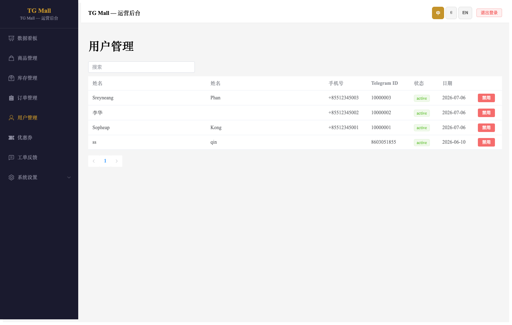
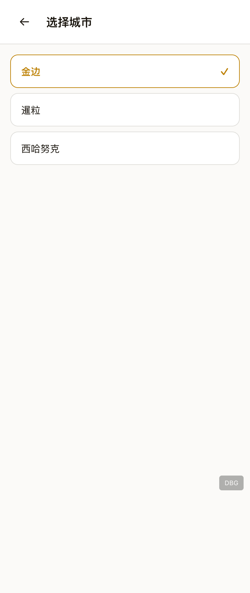
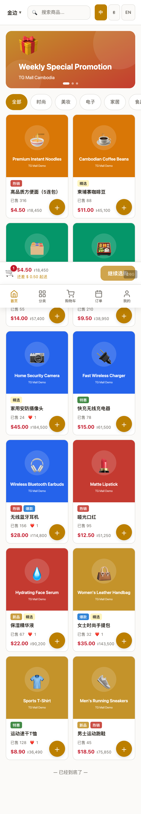
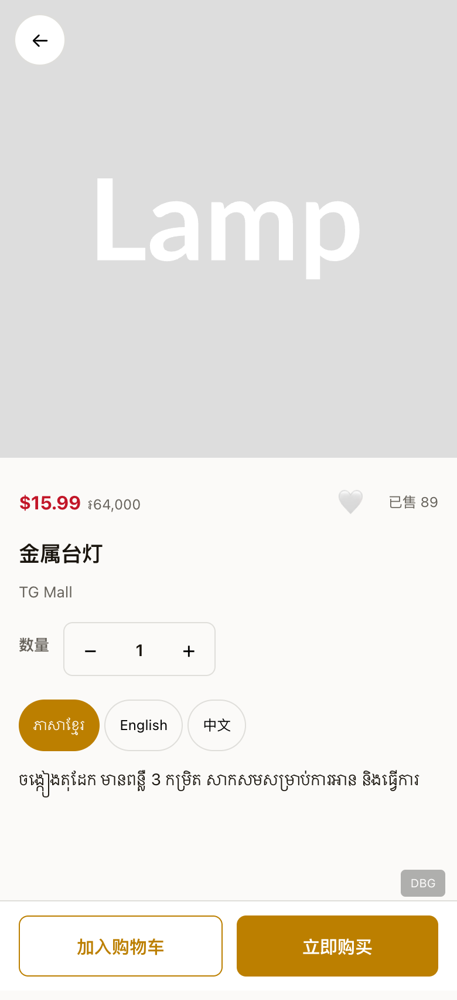
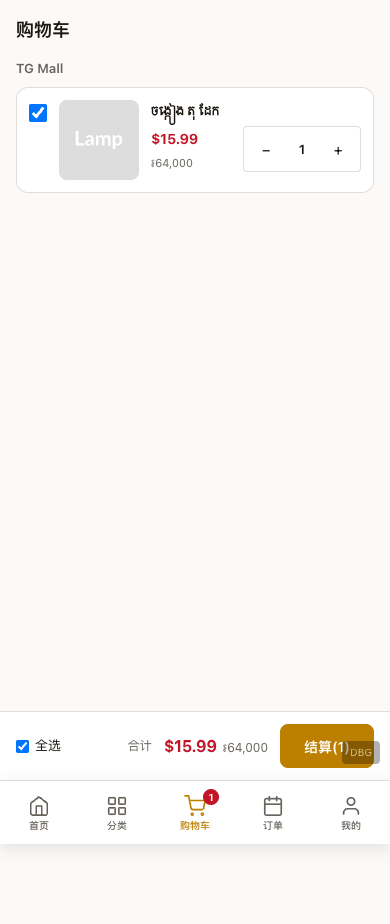

# TG Mall 演示指导文档

> **更新日期**：2026-07-10  
> **截图方式**：Playwright 自动化截图（Chromium · 1440×900 Admin / 390×844 MiniApp）  
> **环境**：本地开发环境 + Demo 模式（`?demo=1` 注入 Telegram WebApp Mock），后端 `PAYMENT_MOCK_MODE=true`

---

## 一、项目概述

TG Mall 是一个面向柬埔寨市场的 Telegram Mini App 电商平台，采用公司自营模式。系统包含两大核心模块：

| 模块 | 地址 | 用途 |
|------|------|------|
| **管理后台** | `https://tgmall-production.up.railway.app/admin` | 运营团队管理商品、订单、Banner、库存等 |
| **商城前端** | Telegram Mini App（移动端 Web） | 消费者浏览商品、下单、支付 |

**使用角色**：
- **运营人员**：通过 Admin 后台进行日常运营
- **消费者**：通过 Telegram Mini App 浏览和购买商品

---

## 二、管理后台演示流程

> 访问地址：`https://tgmall-production.up.railway.app/admin/login`  
> 演示账号：`admin` / `admin123`

### 2.1 登录

打开管理后台，进入登录页面。


输入管理员用户名和密码后点击登录。


### 2.2 数据看板

登录后进入数据看板，可查看平台关键运营指标：订单统计、收入趋势、热门商品等。


### 2.3 商品管理

左侧菜单进入「商品管理」，可查看所有商品列表，支持搜索、筛选、编辑商品信息（多语言名称、价格、库存、规格、图片等）。


### 2.4 订单管理

「订单管理」页展示所有订单，支持按状态筛选（待付款、已付款、配送中、已完成、已取消），可查看订单详情和更新订单状态。


### 2.5 用户管理

「用户管理」页可查看注册用户列表，包括用户基本信息、注册时间、订单数量等。



### 2.6 运营配置

#### 优惠券管理

支持创建和管理优惠券——满减券、折扣券，设置有效期和使用条件。


#### Banner 配置

配置首页轮播 Banner——上传图片、设置跳转链接（商品/分类/外部链接）、排序和启用状态。


#### 品类配置

管理商品分类（如食品、饮料、日用品等），支持多语言名称、排序和图标。


#### 城市管理

配置配送城市和配送费用规则，支持按城市设置不同的运费标准。


#### 平台设置

全局平台参数配置：平台名称、联系方式、支付方式（KHQR/ABA Pay/Wing Pay/COD）开关等。


### 2.7 库存管理

库存管理页可查看各商品 SKU 的当前库存量，支持库存调整操作和库存变动日志查询。


---

## 三、商城前端演示流程

> 环境：Telegram Mini App（移动端适配 · 默认高棉语 · 支持 Km/中/En 三语切换）

### 3.1 首页浏览

消费者进入 Mini App 后首先看到首页，包含：
- **顶部**：城市选择器（默认金边）、搜索栏、语言切换按钮（Km/中/En）
- **Banner 区**：轮播广告图
- **品类横滑**：快速切换商品分类
- **限时特价**：促销商品横滑区
- **商品双列网格**：商品列表（WebP 图片 + 双币种价格）


### 3.2 品类切换

点击顶部品类标签可筛选不同分类的商品。下图展示了切换到「饮料」品类后的效果。


### 3.3 商品详情

点击任意商品卡片进入详情页，包含：
- **图片轮播**：左右滑动查看多张商品图
- **价格信息**：USD/KHR 双币种实时显示
- **商品标签**：新品、热卖、折扣等标签
- **规格选择**：尺寸/口味等 SKU 选择
- **数量调节**：加减按钮控制购买数量
- **收藏按钮**：❤️ 添加/取消收藏


### 3.4 分类浏览

底部导航点击「分类」进入分类页，按品类树浏览商品，支持左侧一级分类 + 右侧二级分类的布局。


### 3.5 搜索商品

点击首页顶部搜索栏进入搜索页，输入关键词（如 "water"）可实时搜索匹配商品。


### 3.6 购物车

底部导航点击「购物车」查看已加入购物车的商品，支持修改数量、删除商品、查看合计金额，点击「去结算」进入下单流程。


### 3.7 城市切换

点击首页顶部城市名称可进入城市选择页，切换配送城市（金边、暹粒、西哈努克等），配送费随城市变化自动更新。



### 3.8 用户登录

消费者可通过手机号（+855 格式）+ 密码登录，也支持手机号 + 短信验证码登录。


### 3.9 个人中心

底部导航点击「我的」进入个人中心，展示：
- 用户头像和昵称
- 我的订单、收藏夹、优惠券入口
- 地址管理、客服反馈
- 设置（语言、关于等）


### 3.10 优惠券中心

在优惠券中心可查看平台发放的可领取优惠券，以及用户已领取的优惠券列表。


### 3.11 底部导航总览

底部固定导航栏包含 5 个入口：

| 图标 | 导航项 | 路由 |
|------|--------|------|
| 🏠 | 首页 | `/` |
| 🗂️ | 分类 | `/category` |
| 🛒 | 购物车 | `/cart` |
| 📋 | 订单 | `/orders` |
| 👤 | 我的 | `/profile` |


### 3.12 消费者支付全流程（Demo 模式）

TG Mall 支持 KHQR、ABA Pay、Wing Pay、Telegram 支付、货到付款等多种支付方式。在本地开发/演示环境中，可在 URL 后追加 `?demo=1` 进入 Demo 模式，自动注入 Telegram WebApp SDK Mock 并开启支付模拟，完整走通「浏览 → 加购 → 下单 → 支付 → 成功」闭环。

> **安全说明**：Demo 模式使用独立的 `/api/v1/auth/demo-login` 端点登录，仅在 `PAYMENT_MOCK_MODE=true` 时启用；生产环境不会注册该路由，真实 Telegram 登录仍通过 `/api/v1/auth/telegram` 进行 HMAC-SHA256 签名校验。

#### 3.12.1 首页浏览与选品

进入 Mini App 首页，浏览 Banner、品类和商品双列网格。点击任意商品卡片进入商品详情。



#### 3.12.2 商品详情

商品详情页展示商品图片、USD/KHR 双币种价格、规格选择、数量调节和三语切换。选择规格和数量后，点击「加入购物车」。



成功加入购物车后，底部导航购物车图标会出现角标提示。


#### 3.12.3 购物车

进入购物车，商品默认全选，底部显示合计金额。确认商品后点击「去结算」。




#### 3.12.4 确认订单

确认订单页展示收货地址、商品清单、配送费、优惠券和支付方式。本次演示选择 **KHQR** 扫码支付，点击「提交订单」。


> 若当前用户还没有收货地址，系统会先引导新增地址（见 `payment-07-checkout-address.png`），保存后返回确认订单页。

#### 3.12.5 KHQR 支付

提交订单后进入 KHQR 支付页，展示订单号、应付金额、支付倒计时和二维码区域。在 Demo 模式下，页面会显示「模拟扫码支付」按钮，点击即可模拟用户完成扫码支付。


#### 3.12.6 支付成功

模拟支付确认后，系统调用支付回调完成订单状态更新，跳转到支付成功页，展示订单号、支付金额和「查看订单」入口。


#### 3.12.7 查看订单

支付完成后进入「我的订单」页，可看到刚支付的订单状态已变为「已付款」，Bot 也会收到对应的订单通知。


---

## 四、核心业务流程演示路径

### 消费者下单全流程（Happy Path）

```
首页浏览 → 搜索/品类筛选 → 商品详情 → 选择规格 → 加入购物车
    → 购物车（默认全选） → 去结算 → 选择/新增地址 → 选择支付方式
    → 提交订单 → KHQR/ABA/Wing 支付（Demo 模式可模拟） → 订单成功 → 查看订单
```

完整支付链路已使用 `?demo=1` Demo 模式自动化截图，详见 3.12 节。

### 运营管理全流程

```
登录后台 → 看板查看数据 → 
  ├─ 商品上架：创建商品 → 填写多语言信息 → 设置价格库存 → 上架
  ├─ Banner 配置：上传 Banner → 设置跳转 → 启用
  ├─ 订单处理：查看新订单 → 确认 → 发货 → 完成
  └─ 库存管理：查看库存 → 库存调整 → 记录日志
```

---

## 五、如何运行演示测试

### 前置条件

```bash
# 1. 安装依赖
cd tgmall-miniapp
npm install

# 2. 安装 Playwright 浏览器
npx playwright install chromium
```

### 运行 Admin 后台演示截图

```bash
cd tgmall-miniapp
npx playwright test admin-demo.spec.js --config=e2e/demo-guide/demo.config.js
```

### 运行 MiniApp 商城演示截图

```bash
# 1. 确保 .env 文件配置了 API 地址（本地开发使用 localhost）
echo "VITE_API_BASE_URL=http://localhost:3000/api/v1" > tgmall-miniapp/.env

# 2. 启动后端 API
cd tgmall-api && npm run dev &

# 3. 启动前端开发服务器
cd tgmall-miniapp && npx vite --port 5173 &

# 4. 运行商城页面演示截图
npx playwright test miniapp-demo.spec.js --config=e2e/demo-guide/demo.config.js

# 5. 运行支付全流程演示截图（Demo 模式）
npx playwright test payment-demo.spec.js --config=e2e/demo-guide/payment-demo.config.js
```

截图输出目录：`项目文档/demo-guide/screenshots/`

---

## 六、截图清单

### Admin 后台（12 张）

| 序号 | 文件名 | 页面 |
|------|--------|------|
| 01 | `admin/01-login.png` | 登录页 |
| 02 | `admin/02-login-filled.png` | 登录 - 已填写 |
| 03 | `admin/03-dashboard.png` | 数据看板 |
| 04 | `admin/04-products.png` | 商品管理 |
| 05 | `admin/05-orders.png` | 订单管理 |
| 06 | `admin/06-users.png` | 用户管理 |
| 07 | `admin/07-coupons.png` | 优惠券管理 |
| 08 | `admin/08-banners.png` | Banner 配置 |
| 09 | `admin/09-categories.png` | 品类配置 |
| 10 | `admin/10-cities.png` | 城市管理 |
| 11 | `admin/11-platform.png` | 平台设置 |
| 12 | `admin/12-inventory.png` | 库存管理 |

### MiniApp 商城（13 张 + 11 张支付演示）

#### 商城页面

| 序号 | 文件名 | 页面 |
|------|--------|------|
| 01 | `miniapp/01-homepage.png` | 首页 |
| 02 | `miniapp/02-homepage-category-switched.png` | 首页 - 品类切换 |
| 03 | `miniapp/03-product-detail.png` | 商品详情 |
| 04 | `miniapp/05-category-page.png` | 分类页 |
| 05 | `miniapp/06-cart-page.png` | 购物车 |
| 06 | `miniapp/07-profile-page.png` | 个人中心 |
| 07 | `miniapp/08-login-page.png` | 登录页 |
| 08 | `miniapp/09-search-page.png` | 搜索页 |
| 09 | `miniapp/10-search-results.png` | 搜索结果 |
| 10 | `miniapp/11-city-select.png` | 城市选择 |
| 11 | `miniapp/12-coupons-page.png` | 优惠券中心 |
| 12 | `miniapp/13-bottom-nav.png` | 底部导航 |

#### 消费者支付全流程（Demo 模式）

| 序号 | 文件名 | 页面 |
|------|--------|------|
| P01 | `miniapp/payment-01-homepage.png` | 首页浏览 |
| P02 | `miniapp/payment-02-product-detail.png` | 商品详情 |
| P03 | `miniapp/payment-03-product-added.png` | 已加入购物车 |
| P04 | `miniapp/payment-04-cart.png` | 购物车 |
| P05 | `miniapp/payment-05-cart-selected.png` | 购物车已全选 |
| P06 | `miniapp/payment-06-checkout.png` | 确认订单 |
| P07 | `miniapp/payment-07-checkout-address.png` | 新增地址（按需） |
| P08 | `miniapp/payment-08-payment-khqr.png` | KHQR 支付页 |
| P09 | `miniapp/payment-09-mock-confirm.png` | 模拟支付确认 |
| P10 | `miniapp/payment-10-success.png` | 支付成功 |
| P11 | `miniapp/payment-11-orders.png` | 订单列表 |

---

## 七、技术要点

### 三语支持
所有用户界面默认高棉语，支持 **Km / 中 / En** 一键切换。Admin 后台通过 LocalStorage 持久化语言偏好。

### 双币种显示
所有商品价格同时显示 **USD（美元）** 和 **KHR（柬埔寨瑞尔）**。

### 响应式设计
- **Admin**：1440px+ 桌面端布局，左侧固定导航 + 右侧内容区
- **MiniApp**：390px 移动端布局，底部固定导航栏，适配 Telegram Mini App 视口

### 支付方式
支持 4 种支付方式：**KHQR**（二维码扫码）、**ABA Pay**、**Wing Pay**、**COD**（货到付款）。

---

> 📝 **维护说明**：当有新页面或流程变更时，更新对应的 Playwright 测试脚本并重新运行截图，然后更新本文档。
