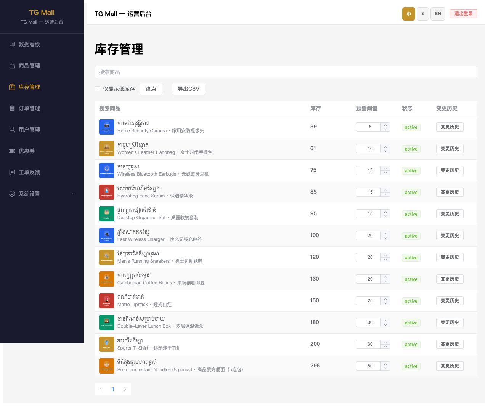
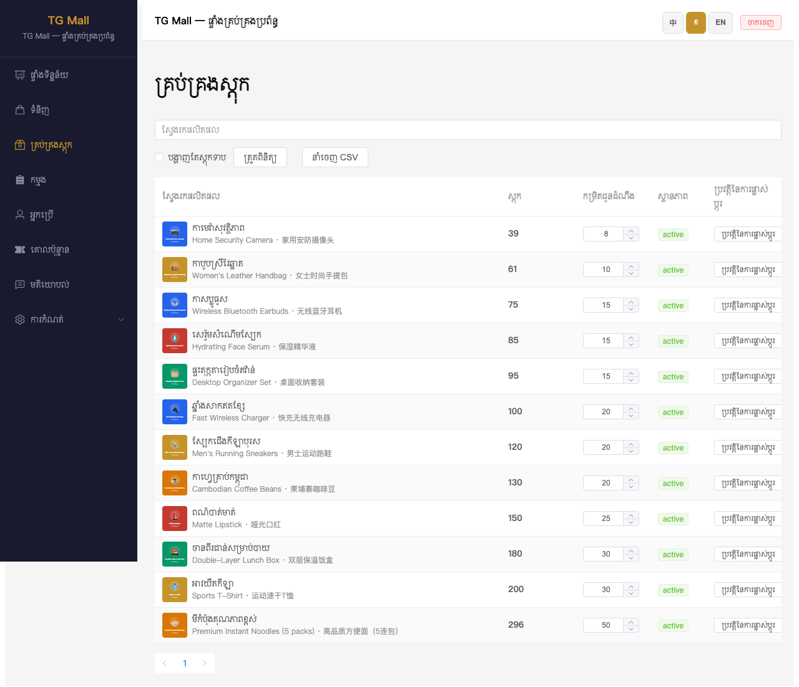
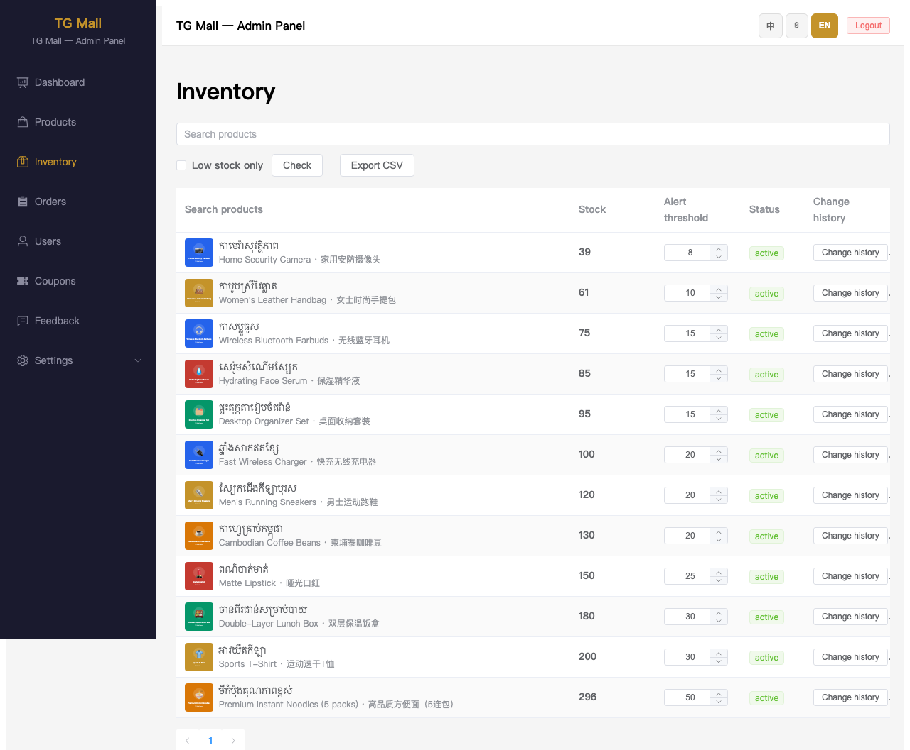

# TG Mall 运营后台 — 库存管理中柬英三语名称操作手册

> **文档版本**：v1.0  
> **更新日期**：2026-07-14  
> **适用环境**：生产环境 `https://tgmall-production.up.railway.app/admin`  
> **对应功能**：库存管理列表支持同时展示高棉语（柬）、英语（英）、中文（中）三语商品名称。

---

## 1. 功能概述

为便于仓储/运营人员对照核对商品库存，运营后台「库存管理」模块已支持**中、柬、英三语名称**同时展示：

- **库存列表**：商品名称列第一行显示高棉语名称，第二行以小字灰色显示英语 + 中文名称，中间以 `·` 分隔。
- **搜索商品**：在库存页搜索时，可依据高棉语名称快速定位商品。
- **库存调整**：点击库存数字可弹出调整框，输入新数量与备注后确认。
- **预警阈值**：在列表中直接修改商品的低库存预警阈值。
- **变更历史**：点击「变更历史」按钮查看该商品的库存变动流水。
- **盘点**：通过「盘点」按钮对指定商品进行实盘数量录入并自动产生差异调整。
- **导出 CSV**：一键导出当前列表的库存数据。
- **多语言 UI**：后台界面语言切换（中 / 柬 / 英）不影响商品名称的三语展示。
- **移动端适配**：手机浏览器访问时，库存列表自动切换为卡片布局，三语名称完整展示。

---

## 2. 操作前准备

1. 使用现代浏览器（Chrome / Safari / Edge）访问：
   ```
   https://tgmall-production.up.railway.app/admin/inventory
   ```
2. 准备好管理员账号和密码。
3. 建议先确认当前后台版本已包含本功能（2026-07-14 之后部署）。

---

## 3. 操作步骤

### 3.1 登录运营后台

访问 `/admin/inventory`，若未登录会自动跳转到登录页：

1. 输入**用户名**和**密码**。
2. 点击「ចូល / 登录 / Login」按钮。
3. 登录成功后进入**库存管理**页面。

---

### 3.2 查看库存列表

进入库存管理页面后，即可看到商品列表的「搜索商品」列已同时展示三语：

- 第一行：**高棉语名称**（主标题）
- 第二行：**英语名称 · 中文名称**（副标题，灰色小字）

例如：

```
កាមេរ៉ាសុវត្ថិភាពផ្ទះ
Home Security Camera · 家用安防摄像头
```

#### 中文界面



#### 高棉语界面



#### 英文界面



> **说明**：界面语言仅影响菜单、按钮、表头等后台文案；商品名称始终同时显示柬、英、中三语，方便运营人员核对。

---

### 3.3 切换后台界面语言

页面右上角提供语言切换按钮：**中 / ខ / EN**。点击即可切换后台 UI 语言，商品名称的三语展示保持不变。

---

### 3.4 调整库存数量

1. 在库存列表中找到目标商品，点击**库存数量**（例如 `39`）。
2. 在弹出的浮层中：
   - 输入新的库存数量。
   - （可选）填写调整备注。
3. 点击**确认**保存。

> **注意**：
> - 库存数量必须是非负整数。
> - 库存调整为 `0` 时，系统会自动将该商品下架（状态变为 `inactive`），并记录一条「自动下架」日志。

---

### 3.5 修改低库存预警阈值

1. 在「预警阈值」列找到目标商品。
2. 点击数字输入框，输入新的阈值（例如 `10`）。
3. 按回车或点击页面空白处即可保存。

---

### 3.6 查看库存变更历史

1. 在目标商品行点击 **变更历史** 按钮。
2. 右侧滑出抽屉，展示该商品的历史库存变动：
   - 变更原因（下单 / 取消订单 / 手动调整 / 盘点 / 自动下架）
   - 变更前后数量
   - 变更数量（正数绿色，负数红色）
   - 备注与时间戳

---

### 3.7 库存盘点

1. 点击页面上方的 **盘点** 按钮。
2. 在弹出的对话框中选择要盘点的商品（支持按名称搜索）。
3. 系统会显示当前系统库存数量。
4. 输入**实际盘点数量**。
5. （可选）填写盘点备注。
6. 点击 **盘点** 确认。

> **说明**：若实际数量与系统数量存在差异，系统会自动调整库存并生成一条盘点日志。

---

### 3.8 导出库存 CSV

1. 点击页面上方的 **导出 CSV** 按钮。
2. 浏览器会自动下载 `inventory.csv` 文件。
3. 文件包含：高棉语名称、库存、预警阈值、状态、是否低库存。

---

### 3.9 移动端查看

使用手机浏览器或开启浏览器开发者工具的移动视口访问 `/admin/inventory`，库存列表会自动切换为卡片布局，三语名称完整展示：


---

## 4. 缺省场景说明

系统会智能处理三语名称的缺省情况：

| 场景 | 列表展示效果 |
|------|-------------|
| 三语齐全 | `高棉语名称`<br>`English Name · 中文名称` |
| 缺少英文 | `高棉语名称`<br>`中文名称` |
| 缺少中文 | `高棉语名称`<br>`English Name` |
| 只有柬文 | `高棉语名称` |

---

## 5. 常见问题

### Q1：为什么库存列表只显示高棉语，没有英文/中文？

请检查该商品在「商品管理」编辑页中是否填写了 Name (English) 和 Name (Chinese)。若未填写，库存列表会按缺省规则隐藏空值。

### Q2：切换后台语言后，商品名称会变吗？

不会。商品名称的三语展示是固定的，不随后台 UI 语言切换而改变。

### Q3：手机上库存列表的布局和桌面不一样？

是的。移动端采用卡片布局，所有字段纵向排列，便于小屏幕查看和操作。

### Q4：调整库存后多久生效？

调整保存后立即生效，并同步记录变更历史。

---

## 6. 验收标准

- [ ] 库存列表「搜索商品」列同时显示柬、英、中三语。
- [ ] 任一语言为空时展示不出现异常分隔符或空行。
- [ ] 库存数量可点击调整并保存。
- [ ] 预警阈值可在列表中直接修改。
- [ ] 变更历史抽屉可正常打开并展示日志。
- [ ] 盘点功能可选择商品并录入实际数量。
- [ ] 导出 CSV 文件内容正确。
- [ ] 切换后台界面语言不影响商品名称三语展示。
- [ ] 移动端库存列表可完整查看三语名称。

---

## 7. 相关文档

- 设计文档：`docs/superpowers/specs/2026-07-14-admin-products-trilingual-name-design.md`
- 实现计划：`docs/superpowers/plans/2026-07-14-admin-products-trilingual-name-plan.md`
- 商品管理手册：`项目文档/qa-guides/admin-products-trilingual-name-guide.md`
- 技术变更：
  - `tgmall-admin/src/pages/InventoryPage.vue`
  - `tgmall-admin/src/components/ProductName.vue`
  - `tgmall-admin/tests/unit/InventoryPage.test.js`
  - `tgmall-admin/tests/unit/ProductName.test.js`
