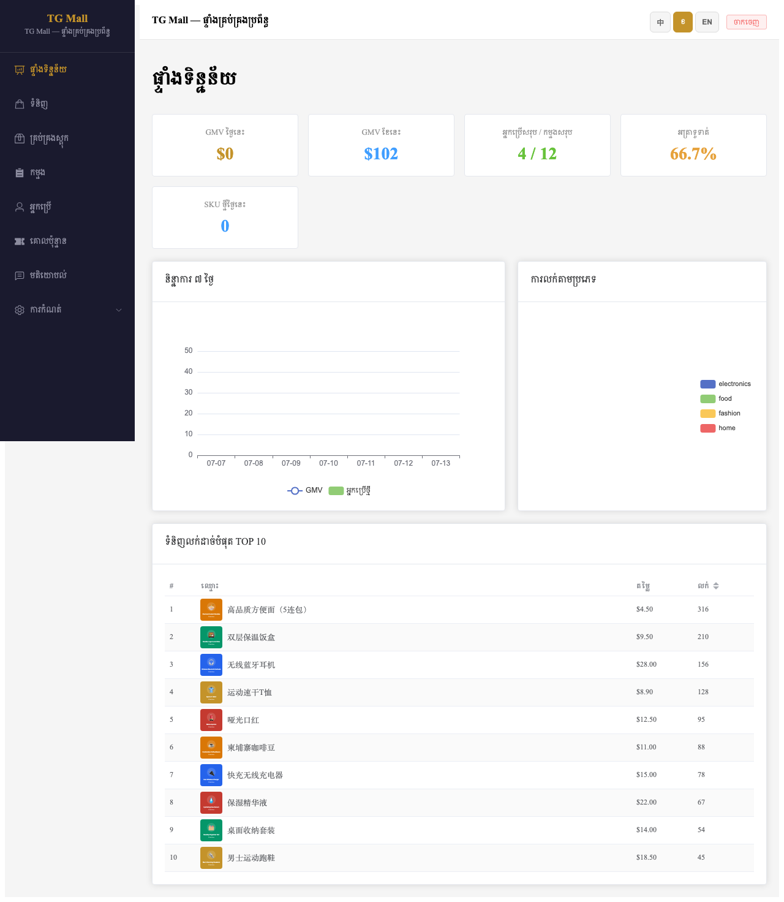
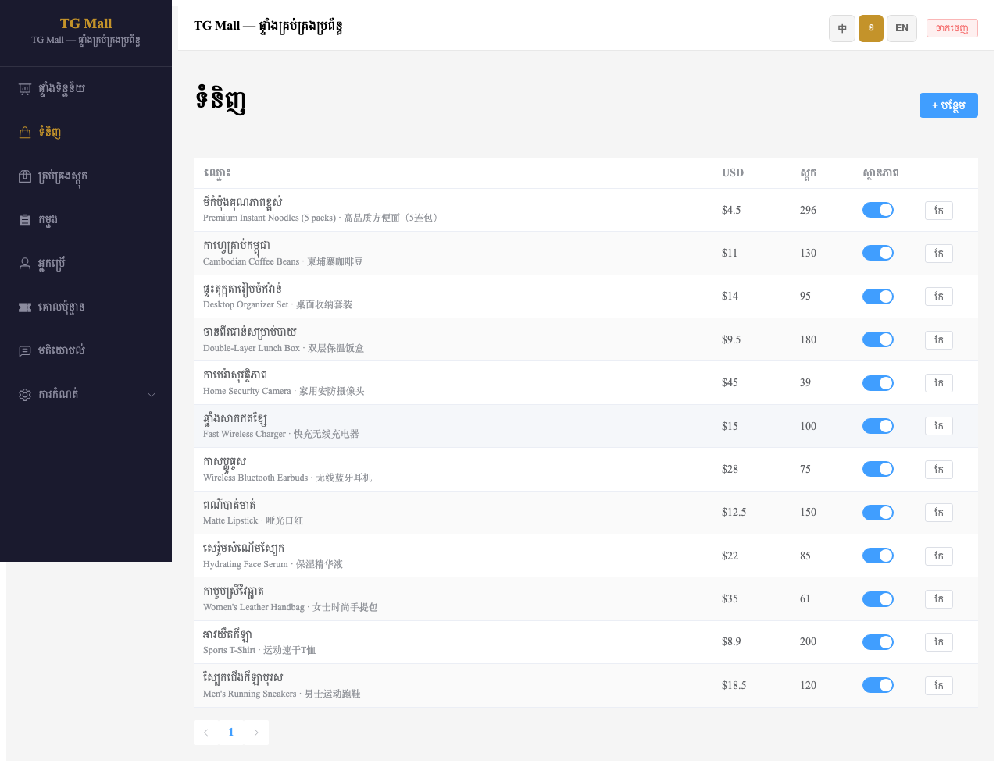
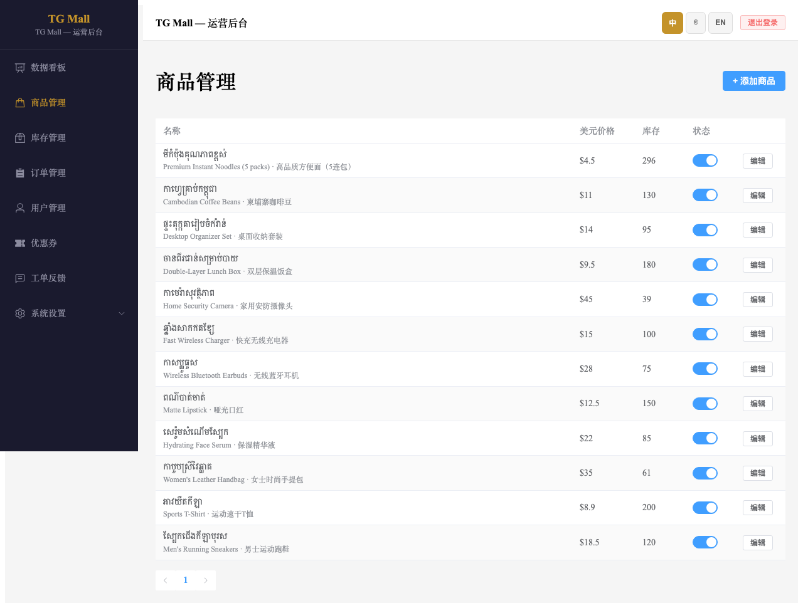
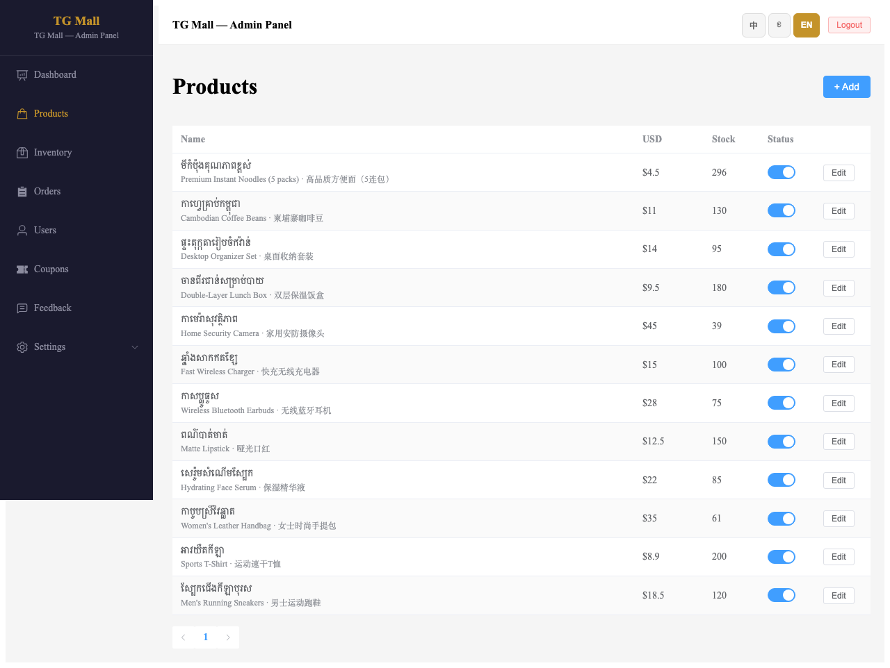
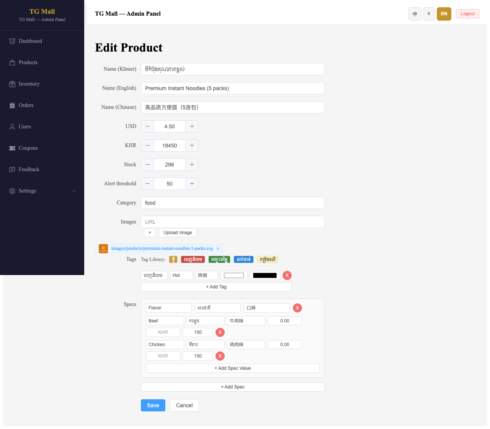
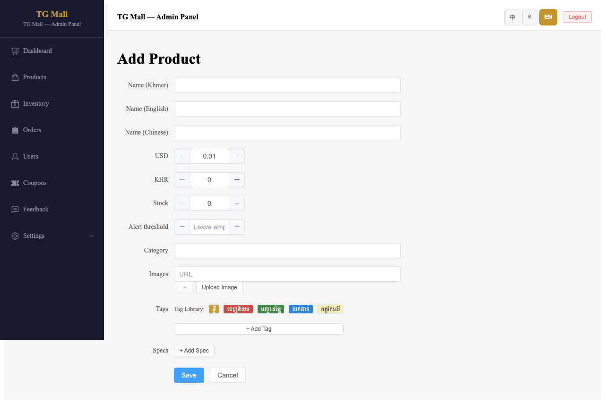
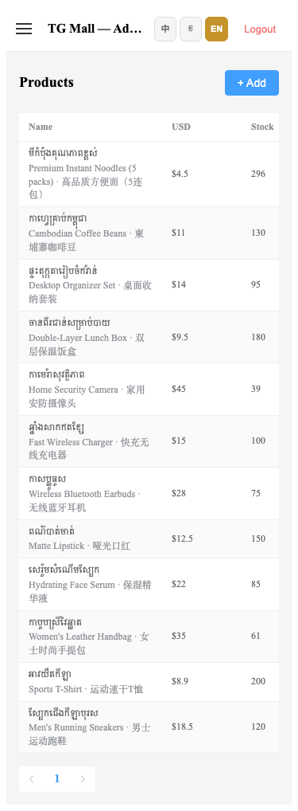

# TG Mall 运营后台 — 商品管理中柬英三语名称操作手册

> **文档版本**：v1.0  
> **更新日期**：2026-07-14  
> **适用环境**：生产环境 `https://tgmall-production.up.railway.app/admin`  
> **对应功能**：商品列表与表单支持同时展示/编辑高棉语（柬）、英语（英）、中文（中）三语名称。

---

## 1. 功能概述

为便于运营人员对照核对商品信息，运营后台「商品管理」模块已支持**中、柬、英三语名称**同时展示：

- **商品列表**：名称列第一行显示高棉语名称，第二行以小字灰色显示英语 + 中文名称，中间以 `·` 分隔。
- **编辑商品**：表单提供 Name (Khmer)、Name (English)、Name (Chinese) 三个独立输入框。
- **添加商品**：新建商品时即可一次性录入三语名称。
- **多语言 UI**：后台界面语言切换（中 / 柬 / 英）不影响商品名称的三语展示。
- **移动端适配**：手机浏览器访问时，商品列表仍完整展示三语名称。

---

## 2. 操作前准备

1. 使用现代浏览器（Chrome / Safari / Edge）访问：
   ```
   https://tgmall-production.up.railway.app/admin/products
   ```
2. 准备好管理员账号和密码。
3. 建议先确认当前后台版本已包含本功能（2026-07-14 之后部署）。

---

## 3. 操作步骤

### 3.1 登录运营后台

访问 `/admin/products`，若未登录会自动跳转到登录页：



1. 输入**用户名**和**密码**。
2. 点击「ចូល / 登录 / Login」按钮。
3. 登录成功后默认进入**数据看板**。

---

### 3.2 进入商品管理

点击左侧导航栏的 **ទំនិញ / 商品管理 / Products**：



进入商品管理页面后，即可看到商品列表的「名称」列已同时展示三语：

- 第一行：**高棉语名称**（主标题）
- 第二行：**英语名称 · 中文名称**（副标题，灰色小字）

例如：

```
ឆីកេនឆាល់ខ្មែរស្រស់
Premium Instant Noodles (5 packs) · 高品质方便面（5连包）
```

---

### 3.3 切换后台界面语言

页面右上角提供语言切换按钮：**中 / ខ / EN**。点击即可切换后台 UI 语言，商品名称的三语展示保持不变。

#### 中文界面



#### 英文界面



> **说明**：界面语言仅影响菜单、按钮、表头等后台文案；商品名称始终同时显示柬、英、中三语，方便运营人员核对。

---

### 3.4 编辑商品三语名称

1. 在商品列表中找到目标商品，点击右侧的 **កែ / 编辑 / Edit** 按钮。
2. 进入编辑表单，页面顶部即为三语名称输入框：



3. 分别修改：
   - **Name (Khmer)**：高棉语名称（必填）
   - **Name (English)**：英语名称（选填）
   - **Name (Chinese)**：中文名称（选填）
4. 修改完成后点击 **Save** 保存，或点击 **Cancel** 取消。

> **注意**：
> - 高棉语名称为必填项。
> - 英语或中文名称若留空，列表中会自动隐藏对应片段及分隔符，不会出现空文本或多余分隔符。

---

### 3.5 添加新商品并录入三语名称

1. 在商品列表页点击右上角的 **+ បន្ថែម / + 添加商品 / + Add** 按钮。
2. 进入添加商品表单：



3. 在页面顶部依次填写：
   - **Name (Khmer)**
   - **Name (English)**
   - **Name (Chinese)**
4. 继续填写价格（USD / KHR）、库存、预警阈值、品类、图片、标签、规格等信息。
5. 点击 **Save** 保存。

---

### 3.6 移动端查看

使用手机浏览器或开启浏览器开发者工具的移动视口访问 `/admin/products`，商品列表会自动适配小屏幕，三语名称完整展示：



---

## 4. 缺省场景说明

系统会智能处理三语名称的缺省情况：

| 场景 | 列表展示效果 |
|------|-------------|
| 三语齐全 | `高棉语名称`<br>`English Name · 中文名称` |
| 缺少英文 | `高棉语名称`<br>`中文名称` |
| 缺少中文 | `高棉语名称`<br>`English Name` |
| 只有柬文 | `高棉语名称` |

---

## 5. 常见问题

### Q1：为什么商品列表只显示高棉语，没有英文/中文？

请检查该商品在编辑页中是否填写了 Name (English) 和 Name (Chinese)。若未填写，列表会按缺省规则隐藏空值。

### Q2：切换后台语言后，商品名称会变吗？

不会。商品名称的三语展示是固定的，不随后台 UI 语言切换而改变。

### Q3：手机上看不到完整的英文/中文名称？

请确认浏览器未开启过大的字体缩放。正常 100% 缩放下，商品名称列会完整展示三语内容。

---

## 6. 验收标准

- [ ] 商品列表「名称」列同时显示柬、英、中三语。
- [ ] 任一语言为空时展示不出现异常分隔符或空行。
- [ ] 编辑商品表单包含独立的三语名称输入框。
- [ ] 添加商品表单包含独立的三语名称输入框。
- [ ] 切换后台界面语言不影响商品名称三语展示。
- [ ] 移动端商品列表可完整查看三语名称。

---

## 7. 相关文档

- 设计文档：`docs/superpowers/specs/2026-07-14-admin-products-trilingual-name-design.md`
- 实现计划：`docs/superpowers/plans/2026-07-14-admin-products-trilingual-name-plan.md`
- 技术变更：
  - `tgmall-admin/src/pages/ProductsPage.vue`
  - `tgmall-admin/tests/unit/ProductsPage.test.js`
