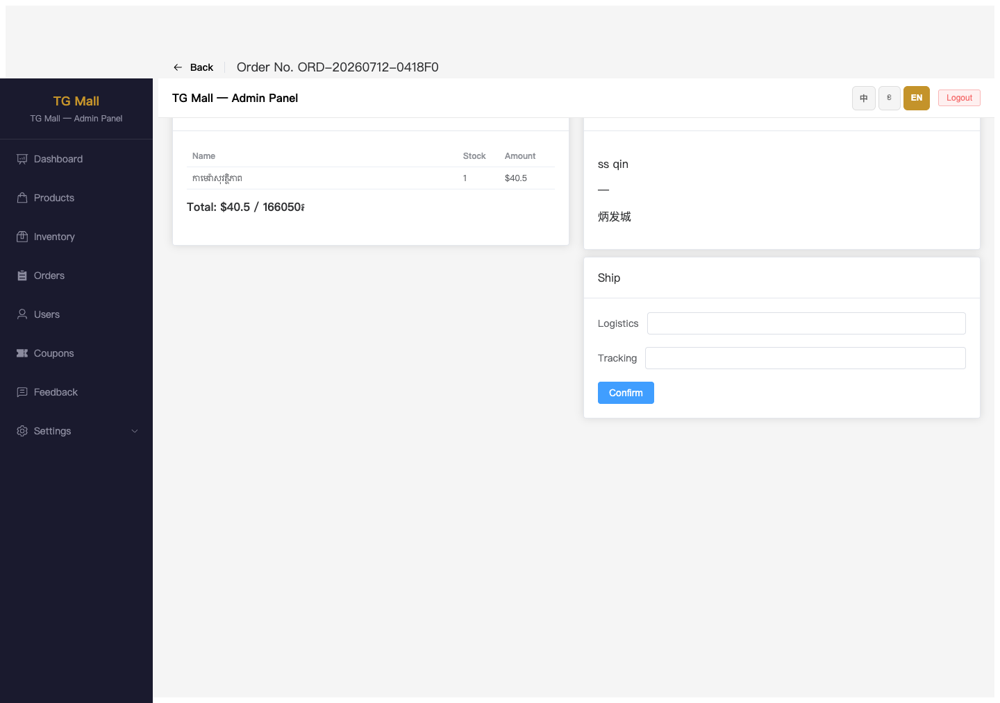
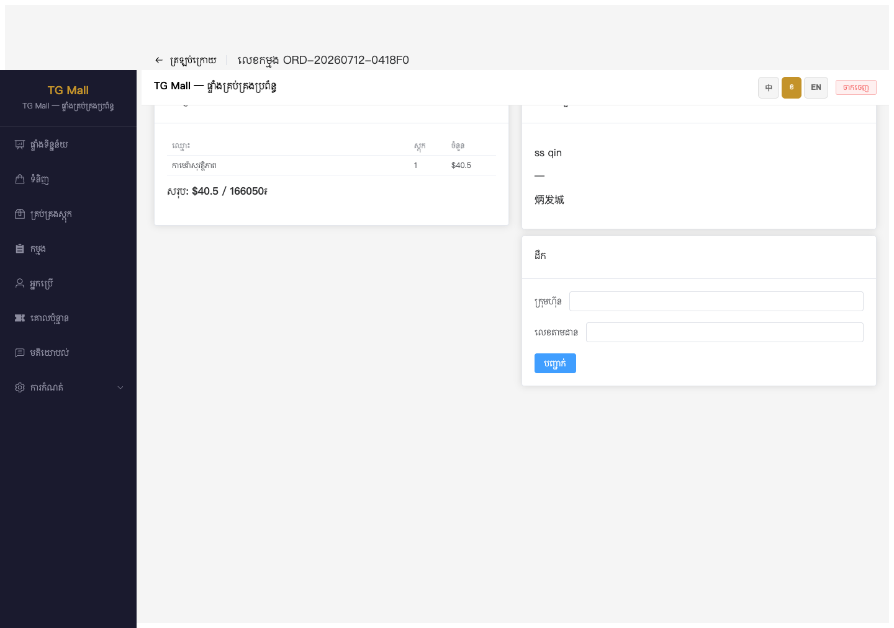
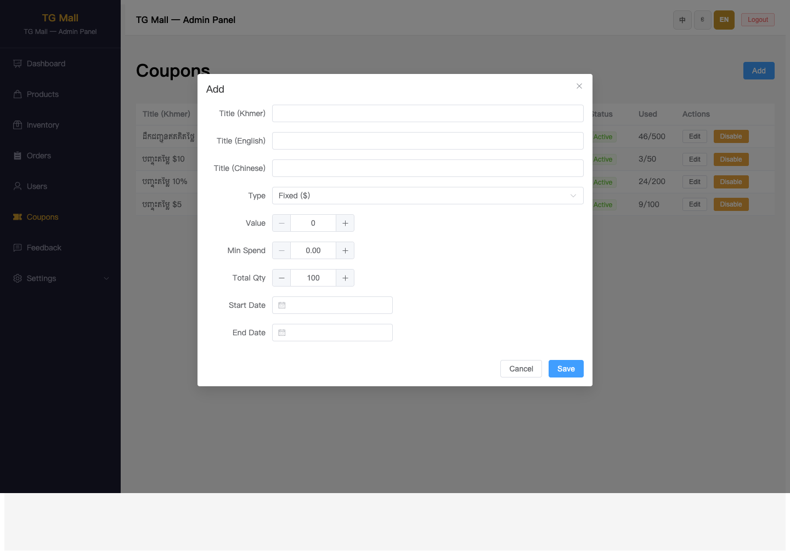
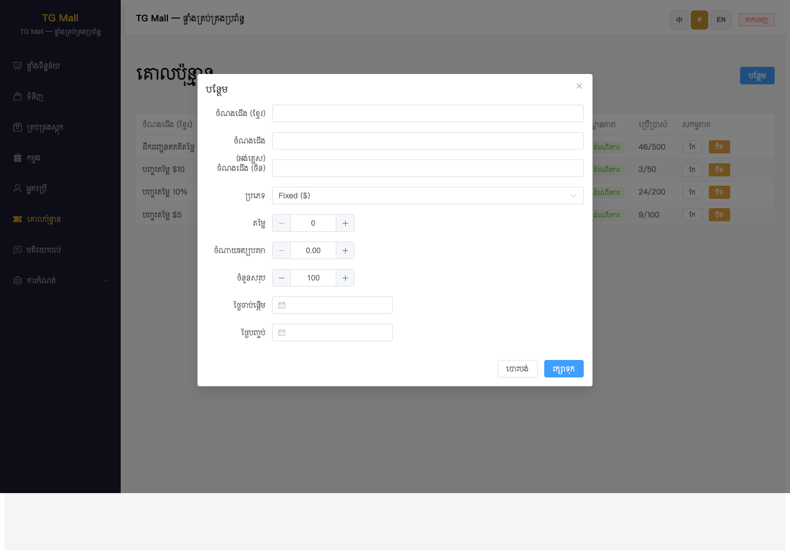
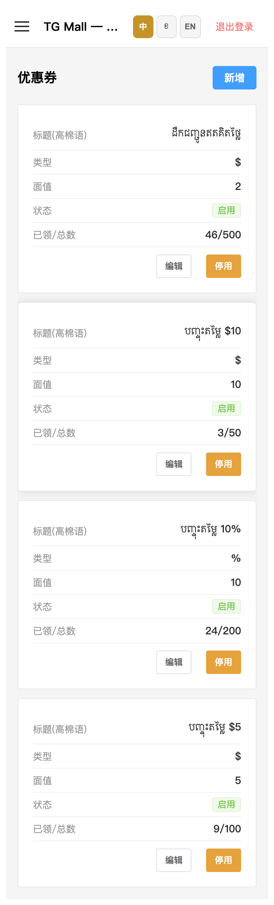

# TG Mall 运营后台 — 订单/用户/优惠券/工单反馈操作手册

> **文档版本**：v1.0  
> **更新日期**：2026-07-15  
> **适用环境**：生产环境 `https://tgmall-production.up.railway.app/admin`  
> **对应功能**：订单管理、用户管理、优惠券、工单反馈四个核心运营页面的使用说明与验收标准。

---

## 1. 功能概述

运营后台的以下四个模块已完成多语言文案修复与功能验证：

- **订单管理**（/admin/orders）：查看订单列表、按状态筛选、按日期范围筛选、导出 CSV、查看订单详情、填写物流发货信息。
- **用户管理**（/admin/users）：查看平台用户、搜索用户、查看手机号/Telegram ID、禁用/解禁用户。
- **优惠券**（/admin/coupons）：查看优惠券列表、新增/编辑优惠券、启用/停用优惠券。
- **工单反馈**（/admin/feedback）：查看用户反馈、按状态筛选、标记已处理、查看反馈图片。

所有页面均支持：

- **三语 UI**：后台界面可在中文、高棉语、英语之间切换。
- **本地化状态标签**：订单、优惠券、工单反馈的状态均按当前语言展示，不再出现 raw key。
- **移动端适配**：手机浏览器访问时，表格自动切换为卡片布局。

---

## 2. 操作前准备

1. 使用现代浏览器（Chrome / Safari / Edge）访问：
   ```
   https://tgmall-production.up.railway.app/admin
   ```
2. 准备好管理员账号和密码。
3. 建议先确认当前后台版本已包含本功能（2026-07-15 之后部署）。

---

## 3. 通用操作

### 3.1 登录运营后台

访问任意后台页面，若未登录会自动跳转到登录页：

1. 输入**用户名**和**密码**。
2. 点击登录按钮。
3. 登录成功后进入后台首页（数据看板）。

---

### 3.2 切换后台界面语言

页面右上角提供语言切换按钮：**中 / ខ / EN**。点击即可切换后台 UI 语言，所有菜单、表头、按钮、状态标签会同步更新。

---

## 4. 订单管理

### 4.1 进入订单管理

点击左侧菜单 **订单管理**，进入订单列表。

### 4.2 订单列表

列表展示：订单号、金额、状态、客户、日期、详情按钮。

顶部 Tab 支持按状态快速筛选：

- 全部
- 待付款
- 待发货
- 已付款
- 已发货
- 已完成
- 已取消（部分版本在 Tab 中，若未显示可在列表中查看）

#### 中文界面


#### 英文界面


#### 高棉语界面


---

### 4.3 按日期范围筛选

1. 在列表上方点击日期选择框。
2. 选择开始日期与结束日期。
3. 列表会自动刷新，仅展示该日期范围内的订单。

---

### 4.4 导出 CSV

1. 点击页面右上角 **导出 CSV** 按钮。
2. 浏览器会自动下载当前筛选条件下的订单 CSV 文件。

---

### 4.5 查看订单详情

1. 在目标订单行点击 **详情** 按钮。
2. 进入订单详情页，可查看：
   - 商品清单（名称、库存、金额）
   - 合计金额（USD / KHR 双币种）
   - 收货地址
   - 发货表单（物流公司、运单号、确认发货按钮）

#### 中文界面


#### 英文界面



#### 高棉语界面



---

### 4.6 确认发货

1. 在订单详情页的「发货」卡片中：
   - 输入**物流公司**名称。
   - 输入**运单号**。
2. 点击 **确认** 按钮。
3. 订单状态会从「待发货」更新为「已发货」。

---

### 4.7 移动端订单管理

使用手机浏览器访问 `/admin/orders`，订单列表会自动切换为卡片布局：


---

## 5. 用户管理

### 5.1 进入用户管理

点击左侧菜单 **用户管理**，进入用户列表。

### 5.2 用户列表

列表展示：名、姓、手机号、Telegram ID、状态、日期、操作按钮。

#### 中文界面


#### 英文界面


#### 高棉语界面


---

### 5.3 搜索用户

1. 在列表上方搜索框输入用户名、姓或手机号关键字。
2. 输入时会自动触发搜索，列表实时刷新。

---

### 5.4 禁用/解禁用户

1. 在目标用户行点击 **禁用** 或 **解禁** 按钮。
2. 操作成功后，该用户状态会更新，按钮文案也会同步切换。

---

### 5.5 移动端用户管理


---

## 6. 优惠券

### 6.1 进入优惠券

点击左侧菜单 **优惠券**，进入优惠券列表。

### 6.2 优惠券列表

列表展示：标题（高棉语）、类型（$ 或 %）、面值、状态、已领/总数、操作按钮。

#### 中文界面


#### 英文界面


#### 高棉语界面


---

### 6.3 新增优惠券

1. 点击页面右上角 **新增** 按钮。
2. 在弹窗中填写：
   - 标题（高棉语）
   - 标题（英语）
   - 标题（中文）
   - 类型：Fixed ($) 或 Percent (%)
   - 面值
   - 最低消费
   - 发行总数
   - 开始日期
   - 结束日期
3. 点击 **保存**。

#### 中文界面


#### 英文界面



#### 高棉语界面



---

### 6.4 启用/停用优惠券

1. 在目标优惠券行点击 **停用** 或 **启用** 按钮。
2. 操作成功后，状态标签与按钮文案会同步更新。

---

### 6.5 编辑优惠券

1. 在目标优惠券行点击 **编辑** 按钮。
2. 修改弹窗中的字段。
3. 点击 **保存**。

---

### 6.6 移动端优惠券



---

## 7. 工单反馈

### 7.1 进入工单反馈

点击左侧菜单 **工单反馈**，进入反馈列表。

### 7.2 反馈列表

列表展示：用户（含手机号）、反馈内容、状态、日期、操作按钮。

顶部支持按状态筛选：

- 全部
- 待处理
- 已处理

#### 中文界面


#### 英文界面


#### 高棉语界面


---

### 7.3 标记已处理

1. 在待处理的反馈行点击 **标记已处理** 按钮。
2. 该反馈状态会从「待处理」变为「已处理」，并停留在当前列表或根据筛选条件消失。

---

### 7.4 查看反馈图片

1. 若反馈包含图片，列表会显示 **图片** 按钮。
2. 点击按钮可查看用户上传的反馈图片。

---

### 7.5 移动端工单反馈


---

## 8. 验收标准

### 订单管理

- [ ] 订单列表按状态 Tab 筛选正常。
- [ ] 日期范围筛选正常。
- [ ] 导出 CSV 按钮可下载文件。
- [ ] 订单详情页展示商品、地址、发货表单。
- [ ] 状态标签按当前 UI 语言展示。
- [ ] 移动端列表切换为卡片布局。

### 用户管理

- [ ] 用户列表表头为「名 / 姓 / 手机号 / Telegram ID / 状态 / 日期」，无重复或 raw key。
- [ ] 搜索框可实时搜索。
- [ ] 禁用/解禁按钮可操作且状态更新。
- [ ] 移动端列表可正常查看。

### 优惠券

- [ ] 优惠券列表状态标签按语言展示（启用/停用）。
- [ ] 新增弹窗可正常打开并保存。
- [ ] 启用/停用按钮可操作。
- [ ] 编辑功能正常。
- [ ] 移动端列表可正常查看。

### 工单反馈

- [ ] 反馈列表状态标签按语言展示（待处理/已处理）。
- [ ] 状态筛选 Tab 正常。
- [ ] 标记已处理按钮可操作。
- [ ] 图片按钮可查看反馈图片。
- [ ] 移动端列表可正常查看。

---

## 9. 常见问题

### Q1：为什么状态列显示英文 raw key（如 active / pending）？

请确认当前部署版本包含 2026-07-15 的修复。若已部署仍出现，请检查对应 locale 文件是否包含该状态键。

### Q2：切换后台语言后，商品名称会变吗？

不会。商品名称的多语展示由商品数据决定，不随后台 UI 语言切换而改变。

### Q3：手机上列表布局和桌面不一样？

是的。移动端采用卡片布局，所有字段纵向排列，便于小屏幕查看和操作。

### Q4：导出 CSV 文件内容为空？

请确认当前筛选条件下存在订单，且网络连接正常。若问题持续，请检查浏览器下载权限。

---

## 10. 相关文档

- QA 报告：`.gstack/qa-reports/qa-report-admin-remaining-2026-07-15.md`
- 库存管理手册：`项目文档/qa-guides/admin-inventory-trilingual-name-guide.md`
- 商品管理手册：`项目文档/qa-guides/admin-products-trilingual-name-guide.md`
- 技术变更：
  - `tgmall-admin/src/pages/UsersPage.vue`
  - `tgmall-admin/src/pages/CouponsPage.vue`
  - `tgmall-admin/src/pages/FeedbackPage.vue`
  - `tgmall-admin/src/locales/zh.json`、`en.json`、`km.json`
  - `tgmall-admin/tests/unit/UsersPage.test.js`
  - `tgmall-admin/tests/unit/CouponsPage.test.js`
  - `tgmall-admin/tests/unit/FeedbackPage.test.js`
