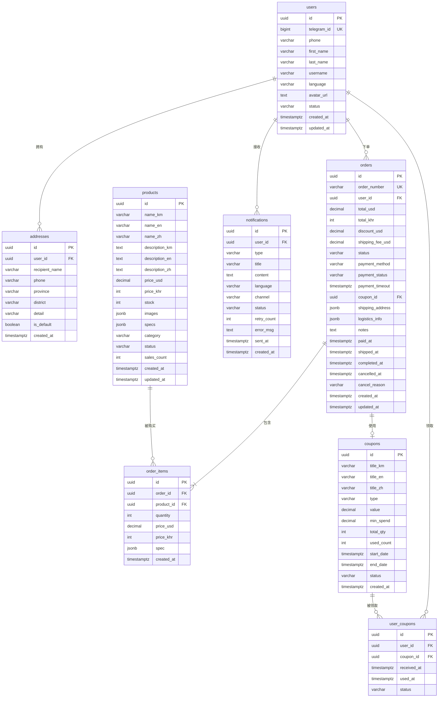

# 数据库设计说明书（ER 图 + 表结构）

## 柬埔寨 Telegram Mini App 社交电商平台

> **文档版本**：V2.0  
> **编制日期**：2026 年 6 月 9 日
> **V2 变更**：切换为公司自营模式；移除原商户数据表；新增 `shop_config` 单表存储平台信息；AdminUser 表保留  
> **对应阶段**：软件工程阶段二 —— 系统设计  
> **对应文档**：产品需求文档_PRD.md · 系统架构设计说明书.md  
> **数据库**：PostgreSQL 15  
> **字符集**：UTF-8（`en_US.UTF-8` + `km_KH.UTF-8`）  
> **保密级别**：内部使用

---

## 目录

- [一、设计概述](#一设计概述)
- [二、实体关系图（ER 图）](#二实体关系图er-图)
- [三、数据字典（完整表结构）](#三数据字典完整表结构)
- [四、索引设计](#四索引设计)
- [五、数据生命周期管理](#五数据生命周期管理)
- [六、安全设计](#六安全设计)
- [七、备份与恢复策略](#七备份与恢复策略)
- [八、Migration 管理规范](#八migration-管理规范)
- [九、性能优化建议](#九性能优化建议)
- [十、附录](#十附录)

---

## 一、设计概述

### 1.1 设计目标

| 目标 | 说明 |
|------|------|
| **数据完整性** | 所有关联通过外键约束保证，核心交易操作使用事务保证 ACID |
| **查询性能** | MVP 阶段支撑 10 万用户 + 10 万商品 + 日均 500 单的查询需求 |
| **多语言支持** | 高棉语、英语、中文三语内容存储和检索，Unicode 完全兼容 |
| **扩展性** | JSONB 字段预留灵活属性（商品规格、物流信息），避免频繁改表 |
| **可维护性** | 所有 DDL 通过 Migration 脚本管理，环境一致性保证 |

### 1.2 命名规范

| 规范项 | 约定 | 示例 |
|--------|------|------|
| **表名** | 小写蛇形命名，复数 | `users`、`order_items` |
| **主键** | 统一用 `id`，UUID 类型 | `id UUID PRIMARY KEY` |
| **外键** | `{关联表单数名}_id` | `user_id`、`coupon_id` |
| **时间字段** | `{动作}_at`，带时区 | `created_at`、`paid_at` |
| **布尔字段** | `is_{状态}` | `is_default` |
| **多语言字段** | `{字段名}_{语言码}` | `name_km`、`name_en`、`name_zh` |
| **索引名** | `idx_{表名}_{字段名}` | `idx_orders_user` |
| **唯一约束名** | `uq_{表名}_{字段名}` | `uq_users_telegram_id` |
| **外键约束名** | `fk_{表名}_{关联表名}` | `fk_orders_user` |

### 1.3 数据类型约定

| 场景 | 类型 | 说明 |
|------|------|------|
| 主键/外键 | `UUID` | 全局唯一，防止 ID 枚举，分布式友好 |
| 短文本（≤200 字符） | `VARCHAR(n)` | 商品名、人名、手机号 |
| 长文本 | `TEXT` | 商品描述、地址详情、驳回原因 |
| 金额（USD） | `DECIMAL(10,2)` | 精确小数，避免浮点精度问题 |
| 金额（KHR） | `INTEGER` | 瑞尔无小数位，整数存储 |
| 布尔 | `BOOLEAN` | 默认值、是否标记 |
| 时间 | `TIMESTAMPTZ` | 带时区的时间戳（UTC 存储，UTC+7 显示） |
| JSON 数据 | `JSONB` | 图片列表、规格、收货地址快照、物流信息 |
| 枚举值（少量） | `VARCHAR(n)` + CHECK 约束 | 状态、类型、品类，业务层枚举 |
| 枚举值（大量） | 独立枚举类型 | 订单状态等固定枚举 |

---

## 二、实体关系图（ER 图）

### 2.1 核心业务 ER 图



### 2.2 实体关系说明

| 父表 | 子表 | 关系 | 基数 | 说明 |
|------|------|------|------|------|
| `users` | `addresses` | 一对多 | 1 : 0..10 | 一个用户最多 10 个收货地址 |
| `users` | `orders` | 一对多 | 1 : 0..N | 一个用户可以下多个订单 |
| `users` | `user_coupons` | 一对多 | 1 : 0..N | 一个用户可以领取多张优惠券 |
| `orders` | `order_items` | 一对多 | 1 : 1..N | 一个订单至少包含 1 件商品 |
| `products` | `order_items` | 一对多 | 1 : 0..N | 一个商品可以出现在多个订单中 |
| `coupons` | `user_coupons` | 一对多 | 1 : 0..N | 一张优惠券可以被多个用户领取 |
| `coupons` | `orders` | 一对多 | 1 : 0..N | 一张优惠券可以被多个订单使用 |

### 2.3 核心业务关系解读

```
"一次下单"涉及的数据关系：

  消费者 (users)
    │
    ├── 使用收货地址 (addresses)         ← 下单时选择一个地址
    ├── 使用优惠券 (user_coupons)        ← 下单时选择一张券
    │
    ├── 创建订单 (orders)               ← 一条订单记录
    │     │
    │     ├── 包含多件商品 (order_items)  ← 每件商品一条记录
    │     │     │
    │     │     └── 引用商品 (products)   ← 记录当时价格快照
    │     │
    │     └── 引用优惠券 (coupons)        ← 记录使用的券
    │
    └── 收到通知 (notifications)         ← 下单后异步推送

"一次发货"涉及的数据关系：

  平台运营后台
    │
    ├── 查看订单 (orders)
    │     │
    │     ├── 填写物流信息 → 状态变更为 shipped
    │     │
    │     └── 触发消费者通知 (notifications)
    │
    └── 订单完成后 → 商品销量累加 (products.sales_count)
```

---

## 三、数据字典（完整表结构）

### 3.1 用户表 `users`

**用途**：存储所有平台用户的基本信息，通过 Telegram 登录自动创建。

| 字段名 | 类型 | 约束 | 默认值 | 说明 |
|--------|------|------|--------|------|
| `id` | `UUID` | **PK** | `gen_random_uuid()` | 用户唯一标识 |
| `telegram_id` | `BIGINT` | **UK, NOT NULL** | — | Telegram 用户 ID，用于登录匹配 |
| `phone` | `VARCHAR(20)` | — | `NULL` | 手机号，+855 格式，下单时必填 |
| `first_name` | `VARCHAR(100)` | — | `NULL` | Telegram 返回的名 |
| `last_name` | `VARCHAR(100)` | — | `NULL` | Telegram 返回的姓 |
| `username` | `VARCHAR(100)` | — | `NULL` | Telegram 用户名（@ 后面部分） |
| `language` | `VARCHAR(5)` | `NOT NULL` | `'km'` | 偏好语言：`km` / `en` / `zh` |
| `avatar_url` | `TEXT` | — | `NULL` | Telegram 头像 URL |
| `status` | `VARCHAR(20)` | `NOT NULL, CHECK` | `'active'` | 账号状态：`active` / `disabled` |
| `created_at` | `TIMESTAMPTZ` | `NOT NULL` | `NOW()` | 注册时间 |
| `updated_at` | `TIMESTAMPTZ` | `NOT NULL` | `NOW()` | 最后更新时间 |

**DDL**：

```sql
-- 创建用户表
-- 说明：通过 Telegram Mini App 一键登录时自动创建，telegram_id 全局唯一
CREATE TABLE users (
  id            UUID PRIMARY KEY DEFAULT gen_random_uuid(),
  telegram_id   BIGINT UNIQUE NOT NULL,
  phone         VARCHAR(20),
  first_name    VARCHAR(100),
  last_name     VARCHAR(100),
  username      VARCHAR(100),
  language      VARCHAR(5) NOT NULL DEFAULT 'km'
                CHECK (language IN ('km', 'en', 'zh')),
  avatar_url    TEXT,
  status        VARCHAR(20) NOT NULL DEFAULT 'active'
                CHECK (status IN ('active', 'disabled')),
  created_at    TIMESTAMPTZ NOT NULL DEFAULT NOW(),
  updated_at    TIMESTAMPTZ NOT NULL DEFAULT NOW()
);

-- 索引：按 Telegram ID 查询（登录时最频繁的查询）
CREATE INDEX idx_users_telegram_id ON users(telegram_id);

-- 索引：按手机号查询（客服/运营查询用户）
CREATE INDEX idx_users_phone ON users(phone);

-- 索引：按语言统计用户分布
CREATE INDEX idx_users_language ON users(language);

-- 索引：按注册时间排序（运营后台用户列表）
CREATE INDEX idx_users_created ON users(created_at DESC);

-- 触发器：自动更新 updated_at
CREATE TRIGGER trg_users_updated_at
  BEFORE UPDATE ON users
  FOR EACH ROW EXECUTE FUNCTION update_updated_at_column();
```

---

### 3.2 商品表 `products`

**用途**：存储所有商品信息。核心表之一，查询最频繁。三语名称+描述，双币种价格，JSONB 存图片和规格。

| 字段名 | 类型 | 约束 | 默认值 | 说明 |
|--------|------|------|--------|------|
| `id` | `UUID` | **PK** | `gen_random_uuid()` | 商品唯一标识 |
| `name_km` | `VARCHAR(300)` | `NOT NULL` | — | 商品名称（高棉语，必填） |
| `name_en` | `VARCHAR(300)` | — | `NULL` | 商品名称（英语） |
| `name_zh` | `VARCHAR(300)` | — | `NULL` | 商品名称（中文） |
| `description_km` | `TEXT` | — | `NULL` | 商品描述（高棉语） |
| `description_en` | `TEXT` | — | `NULL` | 商品描述（英语） |
| `description_zh` | `TEXT` | — | `NULL` | 商品描述（中文） |
| `price_usd` | `DECIMAL(10,2)` | `NOT NULL, CHECK > 0` | — | 美元价格 |
| `price_khr` | `INTEGER` | `NOT NULL, CHECK > 0` | — | 瑞尔价格（整数，如 120000） |
| `stock` | `INTEGER` | `NOT NULL, CHECK >= 0` | `0` | 库存数量 |
| `images` | `JSONB` | `NOT NULL` | `'[]'` | 商品图片 URL 数组 |
| `specs` | `JSONB` | — | `'[]'` | 规格定义（如颜色/尺码） |
| `category` | `VARCHAR(50)` | `NOT NULL, CHECK` | — | 品类 |
| `status` | `VARCHAR(20)` | `NOT NULL, CHECK` | `'active'` | 商品状态 |
| `sales_count` | `INTEGER` | `NOT NULL` | `0` | 累计销量（冗余，加速排序） |
| `created_at` | `TIMESTAMPTZ` | `NOT NULL` | `NOW()` | 创建时间 |
| `updated_at` | `TIMESTAMPTZ` | `NOT NULL` | `NOW()` | 最后更新时间 |

**JSONB 字段结构说明**：

```json
// images — 商品图片列表
[
  {
    "url": "https://cdn.xxx.com/products/xxx.webp",    // 主图 URL
    "thumb_url": "https://cdn.xxx.com/products/xxx_thumb.webp",  // 缩略图
    "width": 800,
    "height": 800,
    "sort_order": 0                                     // 排序，0 = 首图
  }
]

// specs — 商品规格定义
[
  {
    "name_km": "ពណ៌",       // 规格名（高棉语）
    "name_en": "Color",      // 规格名（英语）
    "values": [
      {
        "value_km": "ក្រហម",   // 规格值（高棉语）
        "value_en": "Red",     // 规格值（英语）
        "price_usd": 29.99,    // 该规格价格（可空，空=使用基础价格）
        "price_khr": 120000,
        "stock": 5             // 该规格库存（可空，空=使用基础库存）
      },
      {
        "value_km": "ខៀវ",
        "value_en": "Blue",
        "price_usd": 29.99,
        "price_khr": 120000,
        "stock": 3
      }
    ]
  },
  {
    "name_km": "ទំហំ",
    "name_en": "Size",
    "values": [
      { "value_km": "S", "value_en": "S", "stock": 2 },
      { "value_km": "M", "value_en": "M", "stock": 0 },  // stock=0 表示该规格售罄
      { "value_km": "L", "value_en": "L", "stock": 4 }
    ]
  }
]
```

**DDL**：

```sql
-- 创建商品表
-- 说明：核心查询表，读多写少。商品列表和详情是最频繁的查询。
-- 三语名称+描述分开存储避免 JSON 解析开销；图片和规格用 JSONB 保持灵活性。
CREATE TABLE products (
  id              UUID PRIMARY KEY DEFAULT gen_random_uuid(),
  name_km         VARCHAR(300) NOT NULL,
  name_en         VARCHAR(300),
  name_zh         VARCHAR(300),
  description_km  TEXT,
  description_en  TEXT,
  description_zh  TEXT,
  price_usd       DECIMAL(10,2) NOT NULL CHECK (price_usd > 0),
  price_khr       INTEGER NOT NULL CHECK (price_khr > 0),
  stock           INTEGER NOT NULL DEFAULT 0 CHECK (stock >= 0),
  images          JSONB NOT NULL DEFAULT '[]',
  specs           JSONB DEFAULT '[]',
  category        VARCHAR(50) NOT NULL
                  CHECK (category IN ('fashion', 'beauty', 'electronics', 'home', 'other')),
  status          VARCHAR(20) NOT NULL DEFAULT 'active'
                  CHECK (status IN ('draft', 'active', 'inactive', 'sold_out')),
  sales_count     INTEGER NOT NULL DEFAULT 0 CHECK (sales_count >= 0),
  created_at      TIMESTAMPTZ NOT NULL DEFAULT NOW(),
  updated_at      TIMESTAMPTZ NOT NULL DEFAULT NOW()
);

-- 索引：按品类查询（首页按品类筛选）
CREATE INDEX idx_products_category ON products(category);

-- 索引：按状态查询（仅展示在售商品）
CREATE INDEX idx_products_status ON products(status);

-- 索引：按价格排序
CREATE INDEX idx_products_price_usd ON products(price_usd);

-- 索引：按创建时间倒序（最新上架）
CREATE INDEX idx_products_created ON products(created_at DESC);

-- 索引：按销量倒序（热门商品）
CREATE INDEX idx_products_sales ON products(sales_count DESC);

-- 索引：多语言全文搜索（GIN 索引，支持高棉语/英语/中文关键词搜索）
-- 注意：需要先安装 pg_trgm 扩展才能使用三元组模糊搜索
CREATE EXTENSION IF NOT EXISTS pg_trgm;
CREATE INDEX idx_products_name_trgm ON products
  USING GIN ((
    coalesce(name_km, '') || ' ' ||
    coalesce(name_en, '') || ' ' ||
    coalesce(name_zh, '')
  ) gin_trgm_ops);

-- 复合索引：品类 + 状态 + 创建时间（首页品类筛选的最常见查询组合）
CREATE INDEX idx_products_category_status_created
  ON products(category, status, created_at DESC);

```

---

### 3.3 订单表 `orders`

**用途**：存储所有订单记录。核心交易表，读写频繁。订单状态机严格管理。

| 字段名 | 类型 | 约束 | 默认值 | 说明 |
|--------|------|------|--------|------|
| `id` | `UUID` | **PK** | `gen_random_uuid()` | 订单唯一标识 |
| `order_number` | `VARCHAR(30)` | **UK, NOT NULL** | — | 订单号（`ORD-YYYYMMDD-XXXXXX`） |
| `user_id` | `UUID` | **FK → users, NOT NULL** | — | 下单用户 |
| `total_usd` | `DECIMAL(10,2)` | `NOT NULL, CHECK > 0` | — | 订单总额（USD，实付金额） |
| `total_khr` | `INTEGER` | `NOT NULL, CHECK >= 0` | — | 订单总额（KHR） |
| `discount_usd` | `DECIMAL(10,2)` | `NOT NULL` | `0` | 优惠券抵扣金额（USD） |
| `shipping_fee_usd` | `DECIMAL(10,2)` | `NOT NULL` | `0` | 配送费（USD） |
| `status` | `VARCHAR(20)` | `NOT NULL, CHECK` | `'pending_payment'` | 订单状态 |
| `payment_method` | `VARCHAR(20)` | `NOT NULL, CHECK` | — | 支付方式 |
| `payment_status` | `VARCHAR(20)` | `NOT NULL` | `'pending'` | 支付状态 |
| `payment_timeout` | `TIMESTAMPTZ` | — | 创建时间+15min | 支付超时时间 |
| `coupon_id` | `UUID` | **FK → coupons** | `NULL` | 使用的优惠券 |
| `shipping_address` | `JSONB` | `NOT NULL` | — | 收货地址快照 |
| `logistics_info` | `JSONB` | — | `NULL` | 物流信息（发货时填写） |
| `cod_collection_info` | `JSONB` | — | `NULL` | COD 收款信息（运营确认收款时记录，用于对账审计） |
| `notes` | `TEXT` | — | `NULL` | 用户备注 |
| `paid_at` | `TIMESTAMPTZ` | — | `NULL` | 支付完成时间 |
| `shipped_at` | `TIMESTAMPTZ` | — | `NULL` | 发货时间 |
| `completed_at` | `TIMESTAMPTZ` | — | `NULL` | 完成时间 |
| `cancelled_at` | `TIMESTAMPTZ` | — | `NULL` | 取消时间 |
| `cancel_reason` | `VARCHAR(100)` | — | `NULL` | 取消原因 |
| `created_at` | `TIMESTAMPTZ` | `NOT NULL` | `NOW()` | 下单时间 |
| `updated_at` | `TIMESTAMPTZ` | `NOT NULL` | `NOW()` | 最后更新时间 |

**订单状态机**：

```
在线支付：pending_payment ──支付成功──► paid ──┐
       │                                      │ 平台发货
       │         COD：     confirmed ─────────►┘
       │                                      ▼
       │                                   shipped ──用户确认/7天自动──► completed
       │                                      │
       │                                      │ COD 骑手收款/运营调用 POST /admin/orders/{id}/collect-cod
       │                                      ▼
       │                                    paid ──用户确认/7天自动──► completed
       │
       └──────────────── 超时/用户取消 ──► cancelled
```

* 在线支付订单创建后进入 `pending_payment`，15 分钟内未支付或用户主动取消则进入 `cancelled`；支付成功后进入 `paid`，平台发货后进入 `shipped`；用户确认收货或发货 7 天后自动进入 `completed`。
* COD 订单创建后直接进入 `confirmed`，`payment_status` 为 `pending_cod`；平台发货后进入 `shipped`；骑手送达收款并由运营调用 `POST /api/v1/admin/orders/{id}/collect-cod` 确认后进入 `paid`（`payment_status` 同步变为 `success`，收款信息写入 `cod_collection_info`）；用户确认收货或收款确认 7 天后自动进入 `completed`。
* 终态（不可再变更）：`completed`、`cancelled`。

**JSONB 字段结构说明**：

```json
// shipping_address — 收货地址快照（下单时复制，防止地址修改影响历史订单）
{
  "recipient_name": "Sopheap",
  "phone": "+85512345678",
  "province": "Phnom Penh",
  "district": "Chamkarmon",
  "detail": "No. 123, Street 456, Sangkat BKK1"
}

// logistics_info — 物流信息（平台发货时填写）
{
  "company": "J&T Express",
  "tracking_number": "JT123456789",
  "tracking_url": "https://www.jtexpress.com.kh/track/JT123456789",
  "estimated_delivery": "2026-06-10"
}

// cod_collection_info — COD 收款信息（运营确认收款时记录，用于对账审计）
{
  "collected_amount_usd": 12.50,
  "collected_amount_khr": 51000,
  "collected_at": "2026-06-05T16:30:00.000Z",
  "note": "已从骑手处收款"
}
```

**DDL**：

```sql
-- 创建订单表
-- 说明：核心交易表，状态机严格管理。
-- shipping_address 用 JSONB 做快照（下单后用户可能修改地址，不影响历史订单）。
-- logistics_info 发货时填写，也为 JSONB 保持灵活性。
-- cod_collection_info 记录 COD 实际收款金额、时间、备注，用于对账审计。
CREATE TABLE orders (
  id                UUID PRIMARY KEY DEFAULT gen_random_uuid(),
  order_number      VARCHAR(30) UNIQUE NOT NULL,
  user_id           UUID NOT NULL REFERENCES users(id),
  total_usd         DECIMAL(10,2) NOT NULL CHECK (total_usd > 0),
  total_khr         INTEGER NOT NULL CHECK (total_khr >= 0),
  discount_usd      DECIMAL(10,2) NOT NULL DEFAULT 0 CHECK (discount_usd >= 0),
  shipping_fee_usd  DECIMAL(10,2) NOT NULL DEFAULT 0 CHECK (shipping_fee_usd >= 0),
  status            VARCHAR(20) NOT NULL DEFAULT 'pending_payment'
                    CHECK (status IN ('pending_payment', 'confirmed', 'paid', 'shipped', 'completed', 'cancelled')),
  payment_method    VARCHAR(20) NOT NULL
                    CHECK (payment_method IN ('khqr', 'aba_pay', 'wing_pay', 'cod')),
  payment_status    VARCHAR(20) NOT NULL DEFAULT 'pending'
                    CHECK (payment_status IN ('pending', 'pending_cod', 'processing', 'success', 'failed')),
  payment_timeout   TIMESTAMPTZ,
  coupon_id         UUID REFERENCES coupons(id),
  shipping_address  JSONB NOT NULL,
  logistics_info    JSONB,
  cod_collection_info JSONB,                        -- COD 收款信息（对账审计）
  notes             TEXT,
  paid_at           TIMESTAMPTZ,
  shipped_at        TIMESTAMPTZ,
  completed_at      TIMESTAMPTZ,
  cancelled_at      TIMESTAMPTZ,
  cancel_reason     VARCHAR(100),
  created_at        TIMESTAMPTZ NOT NULL DEFAULT NOW(),
  updated_at        TIMESTAMPTZ NOT NULL DEFAULT NOW()
);

-- 索引：按用户查询（"我的订单"列表 —— 最高频查询）
CREATE INDEX idx_orders_user ON orders(user_id, created_at DESC);

-- 索引：按状态查询（订单状态 Tab 切换）
CREATE INDEX idx_orders_status ON orders(status);

-- 索引：按创建时间查询（运营后台）
CREATE INDEX idx_orders_created ON orders(created_at DESC);

-- 局部索引：待支付订单按超时时间查询（Cron Job 每分钟扫描超时订单）
CREATE INDEX idx_orders_payment_timeout ON orders(payment_timeout)
  WHERE status = 'pending_payment';

-- 局部索引：已支付待发货（平台发货提醒）
CREATE INDEX idx_orders_paid_unsent ON orders(created_at)
  WHERE status = 'paid';

-- 索引：按订单号查询（支付回调、客服查询）
CREATE INDEX idx_orders_number ON orders(order_number);
```

---

### 3.4 订单商品表 `order_items`

**用途**：订单与商品的多对多中间表。记录每件商品的购买数量、当时价格快照、所选规格。

| 字段名 | 类型 | 约束 | 默认值 | 说明 |
|--------|------|------|--------|------|
| `id` | `UUID` | **PK** | `gen_random_uuid()` | 行唯一标识 |
| `order_id` | `UUID` | **FK → orders, NOT NULL** | — | 所属订单 |
| `product_id` | `UUID` | **FK → products, NOT NULL** | — | 购买的商品 |
| `quantity` | `INTEGER` | `NOT NULL, CHECK > 0` | — | 购买数量 |
| `price_usd` | `DECIMAL(10,2)` | `NOT NULL` | — | 下单时商品 USD 单价（快照） |
| `price_khr` | `INTEGER` | `NOT NULL` | — | 下单时商品 KHR 单价（快照） |
| `spec` | `JSONB` | — | `'{}'` | 所选规格 |
| `created_at` | `TIMESTAMPTZ` | `NOT NULL` | `NOW()` | 创建时间 |

**价格快照说明**：`price_usd` 和 `price_khr` 存的是**下单那一刻**的商品价格，而不是引用 `products` 表的当前价格。这样即使平台后续调价，历史订单金额不受影响。

**DDL**：

```sql
-- 创建订单商品表
-- 说明：价格快照保证历史订单的准确性。即使平台后期调价，订单金额不变。
-- ON DELETE CASCADE：订单删除时自动删除关联商品记录。
CREATE TABLE order_items (
  id          UUID PRIMARY KEY DEFAULT gen_random_uuid(),
  order_id    UUID NOT NULL REFERENCES orders(id) ON DELETE CASCADE,
  product_id  UUID NOT NULL REFERENCES products(id),
  quantity    INTEGER NOT NULL CHECK (quantity > 0),
  price_usd   DECIMAL(10,2) NOT NULL,
  price_khr   INTEGER NOT NULL,
  spec        JSONB DEFAULT '{}',
  created_at  TIMESTAMPTZ NOT NULL DEFAULT NOW()
);

-- 索引：按订单查询（查询订单详情 —— 最高频）
CREATE INDEX idx_order_items_order ON order_items(order_id);

-- 索引：按商品查询（统计商品被购买次数 —— 用于销量排行）
CREATE INDEX idx_order_items_product ON order_items(product_id);
```

---

### 3.5 优惠券表 `coupons`

**用途**：存储优惠券模板。所有优惠券均由平台发放。

| 字段名 | 类型 | 约束 | 默认值 | 说明 |
|--------|------|------|--------|------|
| `id` | `UUID` | **PK** | `gen_random_uuid()` | 优惠券唯一标识 |
| `title_km` | `VARCHAR(200)` | `NOT NULL` | — | 券名称（高棉语） |
| `title_en` | `VARCHAR(200)` | — | `NULL` | 券名称（英语） |
| `title_zh` | `VARCHAR(200)` | — | `NULL` | 券名称（中文） |
| `type` | `VARCHAR(20)` | `NOT NULL, CHECK` | — | 券类型 |
| `value` | `DECIMAL(10,2)` | `NOT NULL, CHECK > 0` | — | 面值（USD 金额或折扣百分比） |
| `min_spend` | `DECIMAL(10,2)` | `NOT NULL` | `0` | 最低消费门槛（USD） |
| `total_qty` | `INTEGER` | `NOT NULL, CHECK > 0` | — | 总发放数量 |
| `used_count` | `INTEGER` | `NOT NULL` | `0` | 已使用数量（冗余，加速查询） |
| `start_date` | `TIMESTAMPTZ` | `NOT NULL` | — | 生效开始时间 |
| `end_date` | `TIMESTAMPTZ` | `NOT NULL` | — | 生效结束时间 |
| `status` | `VARCHAR(20)` | `NOT NULL, CHECK` | `'active'` | 券状态 |
| `created_at` | `TIMESTAMPTZ` | `NOT NULL` | `NOW()` | 创建时间 |

**优惠券类型说明**：

| type 值 | 含义 | value 示例 | 说明 |
|---------|------|-----------|------|
| `fixed` | 满减券 | `5.00` | 满 min_spend 减 $5.00 |
| `discount` | 折扣券 | `10.00` | 满 min_spend 打 9 折（value=10 表示 10% off） |
| `free_shipping` | 免邮券 | `0` | 免配送费，value 和 min_spend 可为 0 |

**DDL**：

```sql
-- 创建优惠券表
-- 说明：所有优惠券由平台统一发放。
-- used_count 是冗余字段，用于快速判断是否已抢光，避免 COUNT 查询。
CREATE TABLE coupons (
  id          UUID PRIMARY KEY DEFAULT gen_random_uuid(),
  title_km    VARCHAR(200) NOT NULL,
  title_en    VARCHAR(200),
  title_zh    VARCHAR(200),
  type        VARCHAR(20) NOT NULL
              CHECK (type IN ('fixed', 'discount', 'free_shipping')),
  value       DECIMAL(10,2) NOT NULL CHECK (value >= 0),
  min_spend   DECIMAL(10,2) NOT NULL DEFAULT 0 CHECK (min_spend >= 0),
  total_qty   INTEGER NOT NULL CHECK (total_qty > 0),
  used_count  INTEGER NOT NULL DEFAULT 0 CHECK (used_count >= 0),
  start_date  TIMESTAMPTZ NOT NULL,
  end_date    TIMESTAMPTZ NOT NULL,
  status      VARCHAR(20) NOT NULL DEFAULT 'active'
              CHECK (status IN ('active', 'inactive')),
  created_at  TIMESTAMPTZ NOT NULL DEFAULT NOW(),

  -- 约束：结束时间必须晚于开始时间
  CONSTRAINT chk_coupon_dates CHECK (end_date > start_date),
  -- 约束：已使用数量不超过总发放量
  CONSTRAINT chk_coupon_used CHECK (used_count <= total_qty)
);

-- 索引：按生效时间查询（查询当前可领取的券 —— 高频）
CREATE INDEX idx_coupons_active ON coupons(status, start_date, end_date)
  WHERE status = 'active';

-- 索引：按创建时间排序
CREATE INDEX idx_coupons_created ON coupons(created_at DESC);
```

---

### 3.6 用户优惠券表 `user_coupons`

**用途**：记录用户领取的优惠券及其使用状态。用户与优惠券的多对多关联表。

| 字段名 | 类型 | 约束 | 默认值 | 说明 |
|--------|------|------|--------|------|
| `id` | `UUID` | **PK** | `gen_random_uuid()` | 记录唯一标识 |
| `user_id` | `UUID` | **FK → users, NOT NULL** | — | 领取用户 |
| `coupon_id` | `UUID` | **FK → coupons, NOT NULL** | — | 领取的优惠券 |
| `received_at` | `TIMESTAMPTZ` | `NOT NULL` | `NOW()` | 领取时间 |
| `used_at` | `TIMESTAMPTZ` | — | `NULL` | 使用时间（下单时回填） |
| `status` | `VARCHAR(20)` | `NOT NULL, CHECK` | `'unused'` | 使用状态 |

**DDL**：

```sql
-- 创建用户优惠券表
-- 说明：同一用户对同一张券只能领取一次（UNIQUE 约束）。
-- 优惠券使用后 status 变为 used，used_at 记录使用时间。
CREATE TABLE user_coupons (
  id          UUID PRIMARY KEY DEFAULT gen_random_uuid(),
  user_id     UUID NOT NULL REFERENCES users(id),
  coupon_id   UUID NOT NULL REFERENCES coupons(id),
  received_at TIMESTAMPTZ NOT NULL DEFAULT NOW(),
  used_at     TIMESTAMPTZ,
  status      VARCHAR(20) NOT NULL DEFAULT 'unused'
              CHECK (status IN ('unused', 'used', 'expired')),

  -- 唯一约束：同券同人仅可领取一张
  CONSTRAINT uq_user_coupon UNIQUE(user_id, coupon_id)
);

-- 索引：按用户查询（"我的优惠券"列表 —— 高频）
CREATE INDEX idx_user_coupons_user ON user_coupons(user_id, status);

-- 索引：按优惠券查询（统计某券的领取情况）
CREATE INDEX idx_user_coupons_coupon ON user_coupons(coupon_id);
```

---

### 3.7 收货地址表 `addresses`

**用途**：存储用户的收货地址。每个用户最多保存 10 个地址。

| 字段名 | 类型 | 约束 | 默认值 | 说明 |
|--------|------|------|--------|------|
| `id` | `UUID` | **PK** | `gen_random_uuid()` | 地址唯一标识 |
| `user_id` | `UUID` | **FK → users, NOT NULL** | — | 归属用户 |
| `recipient_name` | `VARCHAR(100)` | `NOT NULL` | — | 收件人姓名 |
| `phone` | `VARCHAR(20)` | `NOT NULL` | — | 收件人手机号（+855 格式） |
| `province` | `VARCHAR(50)` | `NOT NULL` | — | 省/直辖市 |
| `district` | `VARCHAR(50)` | `NOT NULL` | — | 区/县 |
| `detail` | `VARCHAR(200)` | `NOT NULL` | — | 详细地址（街道/门牌号） |
| `is_default` | `BOOLEAN` | `NOT NULL` | `false` | 是否默认地址 |
| `created_at` | `TIMESTAMPTZ` | `NOT NULL` | `NOW()` | 创建时间 |

**DDL**：

```sql
-- 创建收货地址表
-- 说明：下单时地址快照存到 orders.shipping_address，此后用户修改地址不影响历史订单。
-- 每个用户最多 10 个地址，这个限制在应用层校验。
CREATE TABLE addresses (
  id              UUID PRIMARY KEY DEFAULT gen_random_uuid(),
  user_id         UUID NOT NULL REFERENCES users(id) ON DELETE CASCADE,
  recipient_name  VARCHAR(100) NOT NULL,
  phone           VARCHAR(20) NOT NULL,
  province        VARCHAR(50) NOT NULL,
  district        VARCHAR(50) NOT NULL,
  detail          VARCHAR(200) NOT NULL,
  is_default      BOOLEAN NOT NULL DEFAULT false,
  created_at      TIMESTAMPTZ NOT NULL DEFAULT NOW()
);

-- 索引：按用户查询（获取用户地址列表 —— 高频）
CREATE INDEX idx_addresses_user ON addresses(user_id);

-- 局部唯一索引：每个用户只有一个默认地址
-- 说明：将 is_default=true 的地址设为约束，同一用户不会有两个默认地址
CREATE UNIQUE INDEX uq_addresses_default ON addresses(user_id)
  WHERE is_default = true;
```

---

### 3.8 通知记录表 `notifications`

**用途**：记录所有通过 Telegram Bot 发送的通知消息，用于追踪送达情况和排查问题。

| 字段名 | 类型 | 约束 | 默认值 | 说明 |
|--------|------|------|--------|------|
| `id` | `UUID` | **PK** | `gen_random_uuid()` | 通知唯一标识 |
| `user_id` | `UUID` | **FK → users** | `NULL` | 接收通知的用户 |
| `type` | `VARCHAR(30)` | `NOT NULL` | — | 通知类型 |
| `title` | `VARCHAR(200)` | — | `NULL` | 通知标题 |
| `content` | `TEXT` | `NOT NULL` | — | 通知内容（已填充变量的三语文案） |
| `language` | `VARCHAR(5)` | — | `NULL` | 发送语言 |
| `channel` | `VARCHAR(20)` | `NOT NULL` | `'telegram_bot'` | 发送渠道 |
| `status` | `VARCHAR(20)` | `NOT NULL` | `'sent'` | 发送状态 |
| `retry_count` | `INTEGER` | `NOT NULL` | `0` | 重试次数 |
| `error_msg` | `TEXT` | — | `NULL` | 失败原因 |
| `sent_at` | `TIMESTAMPTZ` | — | `NOW()` | 发送时间 |
| `created_at` | `TIMESTAMPTZ` | `NOT NULL` | `NOW()` | 创建时间 |

**通知类型枚举**：

| type 值 | 说明 | 接收方 |
|---------|------|--------|
| `order_created` | 订单已创建 | 消费者 |
| `payment_success` | 支付成功 | 消费者 |
| `order_shipped` | 订单已发货 | 消费者 |
| `order_completed` | 订单已完成 | 消费者 |
| `order_cancelled` | 订单已取消 | 消费者 |
| `coupon_expiring` | 优惠券即将过期 | 消费者 |

**DDL**：

```sql
-- 创建通知记录表
-- 说明：仅用于追踪记录，不驱动业务流程。消息队列的可靠性由 BullMQ 保证。
-- user_id 非空（通知必须有接收方）。
CREATE TABLE notifications (
  id          UUID PRIMARY KEY DEFAULT gen_random_uuid(),
  user_id     UUID REFERENCES users(id),
  type        VARCHAR(30) NOT NULL,
  title       VARCHAR(200),
  content     TEXT NOT NULL,
  language    VARCHAR(5),
  channel     VARCHAR(20) NOT NULL DEFAULT 'telegram_bot',
  status      VARCHAR(20) NOT NULL DEFAULT 'sent'
              CHECK (status IN ('pending', 'sent', 'failed')),
  retry_count INTEGER NOT NULL DEFAULT 0 CHECK (retry_count >= 0 AND retry_count <= 3),
  error_msg   TEXT,
  sent_at     TIMESTAMPTZ DEFAULT NOW(),
  created_at  TIMESTAMPTZ NOT NULL DEFAULT NOW(),

  -- 约束：通知接收方非空
  CONSTRAINT chk_notification_recipient
    CHECK (user_id IS NOT NULL)
);

-- 索引：按用户查询（用户的消息历史）
CREATE INDEX idx_notifications_user ON notifications(user_id, created_at DESC);

-- 索引：按类型查询（统计各类通知的发送成功率）
CREATE INDEX idx_notifications_type ON notifications(type, created_at DESC);

-- 索引：按状态查询（查询发送失败的通知 —— 运维排查）
CREATE INDEX idx_notifications_status ON notifications(status)
  WHERE status = 'failed';

-- 索引：按创建时间
CREATE INDEX idx_notifications_created ON notifications(created_at DESC);
```

---

### 3.9 管理员用户表 `admin_users`（V2 新增）

**用途**：管理后台用户名密码登录。替代 V1 的 Telegram Token 认证方式。

| 字段 | 类型 | 约束 | 默认值 | 说明 |
|------|------|------|--------|------|
| `id` | `UUID` | **PK** | `gen_random_uuid()` | 管理员唯一标识 |
| `username` | `VARCHAR(50)` | **UNIQUE, NOT NULL** | — | 登录用户名 |
| `password_hash` | `VARCHAR(255)` | `NOT NULL` | — | bcrypt 密码哈希 |
| `display_name` | `VARCHAR(100)` | — | `NULL` | 显示名称 |
| `role` | `VARCHAR(20)` | `NOT NULL` | `'admin'` | 角色：admin/operator/cs/warehouse |
| `status` | `VARCHAR(20)` | `NOT NULL` | `'active'` | 账号状态：active/banned |
| `created_at` | `TIMESTAMPTZ` | `NOT NULL` | `NOW()` | 创建时间 |
| `updated_at` | `TIMESTAMPTZ` | `NOT NULL` | `NOW()` | 更新时间 |

**角色说明**：

| 角色 | 权限 |
|------|------|
| `admin` | 全部权限 |
| `operator` | 商品管理 + 订单处理 |
| `cs` | 查看订单 + 用户信息 |
| `warehouse` | 订单发货 |

**DDL**：

```sql
CREATE TABLE admin_users (
  id            UUID PRIMARY KEY DEFAULT gen_random_uuid(),
  username      VARCHAR(50) UNIQUE NOT NULL,
  password_hash VARCHAR(255) NOT NULL,
  display_name  VARCHAR(100),
  role          VARCHAR(20) NOT NULL DEFAULT 'admin',
  status        VARCHAR(20) NOT NULL DEFAULT 'active',
  created_at    TIMESTAMPTZ NOT NULL DEFAULT NOW(),
  updated_at    TIMESTAMPTZ NOT NULL DEFAULT NOW()
);
```

**种子数据**：启动时自动创建默认管理员 `admin`。密码必须来自环境变量 `ADMIN_PASSWORD`；若未设置，种子脚本必须抛出错误并终止启动，禁止任何默认密码。

---

### 3.10 平台配置表 `shop_config`（V2 新增）

**用途**：存储平台信息。设计为单条记录（`id = 1`），用于小程序端展示平台名称、Logo、联系方式等。

| 字段名 | 类型 | 约束 | 默认值 | 说明 |
|--------|------|------|--------|------|
| `id` | `INTEGER` | **PK** | `1` | 固定为 1，确保单行 |
| `name_km` | `VARCHAR(200)` | `NOT NULL` | — | 平台名称（高棉语） |
| `name_en` | `VARCHAR(200)` | — | `NULL` | 平台名称（英语） |
| `name_zh` | `VARCHAR(200)` | — | `NULL` | 平台名称（中文） |
| `logo` | `TEXT` | — | `NULL` | 平台 Logo URL |
| `contact_phone` | `VARCHAR(20)` | — | `NULL` | 客服电话（+855 格式） |
| `created_at` | `TIMESTAMPTZ` | `NOT NULL` | `NOW()` | 创建时间 |
| `updated_at` | `TIMESTAMPTZ` | `NOT NULL` | `NOW()` | 最后更新时间 |

**DDL**：

```sql
-- 平台配置表：单行记录，应用层限制仅允许 id=1
CREATE TABLE shop_config (
  id            INTEGER PRIMARY KEY DEFAULT 1 CHECK (id = 1),
  name_km       VARCHAR(200) NOT NULL,
  name_en       VARCHAR(200),
  name_zh       VARCHAR(200),
  logo          TEXT,
  contact_phone VARCHAR(20),
  created_at    TIMESTAMPTZ NOT NULL DEFAULT NOW(),
  updated_at    TIMESTAMPTZ NOT NULL DEFAULT NOW()
);

-- 触发器：自动更新 updated_at
CREATE TRIGGER trg_shop_config_updated_at
  BEFORE UPDATE ON shop_config
  FOR EACH ROW EXECUTE FUNCTION update_updated_at_column();
```

**种子数据**：

```sql
INSERT INTO shop_config (id, name_km, name_en, name_zh, contact_phone)
VALUES (1, 'TG Mall', 'TG Mall', 'TG Mall', '+85512345678')
ON CONFLICT (id) DO NOTHING;
```


---

## 四、索引设计

### 4.1 索引总览

| 表 | 索引数量 | 唯一索引 | 复合索引 | 局部索引 | 全文索引 |
|----|----------|----------|----------|----------|----------|
| `users` | 4 | 1 (`telegram_id`) | 0 | 0 | 0 |
| `products` | 6 | 0 | 1 | 0 | 1 (GIN trgm) |
| `orders` | 6 | 1 (`order_number`) | 1 | 2 | 0 |
| `order_items` | 2 | 0 | 0 | 0 | 0 |
| `coupons` | 2 | 0 | 0 | 1 | 0 |
| `user_coupons` | 2 | 1 (`user_id+coupon_id`) | 0 | 0 | 0 |
| `addresses` | 2 | 0 | 0 | 1 | 0 |
| `notifications` | 3 | 0 | 0 | 1 | 0 |
| `admin_users` | 1 | 1 (`username`) | 0 | 0 | 0 |
| `shop_config` | 0 | 0 | 0 | 0 | 0 |
| **合计** | **28** | **4** | **2** | **5** | **1** |

### 4.2 索引设计原则

| 原则 | 应用 |
|------|------|
| **最左前缀匹配** | 复合索引列顺序：等值查询列 → 范围查询列 → 排序列 |
| **覆盖索引** | 高频查询的 SELECT 列尽量包含在索引中，避免回表 |
| **避免冗余索引** | `(a,b)` 可以覆盖 `(a)` 的查询场景，所以不再单独建 `(a)` |
| **局部索引減体积** | 只对特定状态的数据建索引（如 `WHERE status = 'pending_payment'`），减少索引体积 |
| **定期维护** | 每月执行 `REINDEX` + `ANALYZE` 更新统计信息 |

### 4.3 核心查询与索引匹配

| 查询场景 | SQL 模式 | 使用索引 |
|----------|----------|----------|
| **首页商品列表（默认排序）** | `WHERE status='active' AND stock>0 ORDER BY created_at DESC` | `idx_products_status` + `idx_products_created`（Bitmap Index Scan） |
| **首页按品类筛选** | `WHERE category='fashion' AND status='active' ORDER BY created_at DESC` | `idx_products_category_status_created`（完全匹配复合索引） |
| **商品搜索** | `WHERE name_km ILIKE '%关键词%' OR name_en ILIKE '%关键词%'` | `idx_products_name_trgm`（三元组模糊搜索） |
| **我的订单** | `WHERE user_id='xxx' ORDER BY created_at DESC` | `idx_orders_user`（完全匹配复合索引） |
| **待发货订单** | `WHERE status='paid' ORDER BY created_at DESC` | `idx_orders_paid_unsent`（局部索引，精确匹配） |
| **超时取消扫描** | `WHERE status='pending_payment' AND payment_timeout < NOW()` | `idx_orders_payment_timeout`（局部索引，精确匹配） |
| **我的优惠券** | `WHERE user_id='xxx' AND status='unused'` | `idx_user_coupons_user`（完全匹配复合索引） |

---

## 五、数据生命周期管理

### 5.1 数据增长预估

| 表 | MVP 期末（3 个月） | 第一年末 | 第三年末 |
|----|--------------------|----------|----------|
| `users` | 10,000 | 200,000 | 1,000,000 |
| `products` | 1,000 | 20,000 | 200,000 |
| `orders` | 1,500 | 50,000 | 500,000 |
| `order_items` | 3,000 | 100,000 | 1,000,000 |
| `notifications` | 10,000 | 500,000 | 5,000,000 |

### 5.2 数据归档策略

| 表 | 归档策略 | 触发条件 |
|------|----------|----------|
| `orders` | 已完成/已取消的订单，1 年后迁移到 `orders_archive` 表 | 定时任务，每月 1 号执行 |
| `notifications` | 90 天前的通知记录直接删除（通知仅用于追踪，业务价值随时间衰减） | 定时任务，每周日执行 |
| `user_coupons` | 已使用/已过期的记录，6 个月后迁移到归档表 | 定时任务，每月 1 号执行 |

```sql
-- 通知记录自动清理（定时任务，每周日 02:00 UTC+7 执行）
DELETE FROM notifications
WHERE created_at < NOW() - INTERVAL '90 days'
  AND status IN ('sent', 'failed');

-- 已完成订单归档（定时任务，每月 1 号 03:00 UTC+7 执行）
INSERT INTO orders_archive
SELECT * FROM orders
WHERE status IN ('completed', 'cancelled')
  AND updated_at < NOW() - INTERVAL '1 year';

DELETE FROM orders
WHERE status IN ('completed', 'cancelled')
  AND updated_at < NOW() - INTERVAL '1 year';
```

### 5.3 数据保留期限

| 数据类型 | 保留期限 | 法律/业务依据 |
|----------|----------|--------------|
| 用户个人信息 | 账号存续期间 + 注销后 90 天 | 隐私合规（GDPR 最小化原则） |
| 订单交易记录 | 5 年 | 柬埔寨税务合规（VAT 申报） |
| 支付流水 | 5 年 | 财务审计要求 |
| 通知记录 | 90 天 | 仅用于问题追踪，无长期价值 |
| 系统日志 | 90 天 | 运维排查需要 |
| 数据库备份 | 30 天 | 恢复策略要求 |

---

## 六、安全设计

### 6.1 数据加密

| 加密对象 | 加密方式 | 密钥管理 |
|----------|----------|----------|
| **静态加密（用户手机号）** | AES-256-CBC，应用层加解密 | 密钥通过环境变量注入，不入库 |
| **传输加密（客户端↔服务器）** | TLS 1.3，全链路 HTTPS | Let's Encrypt 自动续期 |
| **传输加密（服务器↔数据库）** | PostgreSQL SSL 连接 | 自签证书（内网） |
| **备份文件加密** | S3 SSE-S3（服务端加密） | AWS 托管密钥 |
| **密码哈希（如有）** | bcrypt，salt rounds=12 | — |

### 6.2 访问控制

```sql
-- 应用层数据库用户（最小权限原则）

-- API 服务用户（日常读写）
CREATE USER tgmall_api WITH PASSWORD 'xxx';
GRANT SELECT, INSERT, UPDATE, DELETE ON ALL TABLES IN SCHEMA public TO tgmall_api;
GRANT USAGE ON ALL SEQUENCES IN SCHEMA public TO tgmall_api;

-- 只读用户（数据分析、报表查询）
CREATE USER tgmall_readonly WITH PASSWORD 'xxx';
GRANT SELECT ON ALL TABLES IN SCHEMA public TO tgmall_readonly;

-- Migration 用户（表结构变更）
CREATE USER tgmall_migration WITH PASSWORD 'xxx';
GRANT ALL ON SCHEMA public TO tgmall_migration;
GRANT ALL ON ALL TABLES IN SCHEMA public TO tgmall_migration;

-- 严禁应用使用 superuser 或 owner 账号连接数据库
```

### 6.3 SQL 注入防护

```javascript
// ✅ 正确：使用 Prisma 参数化查询
const user = await prisma.user.findUnique({
  where: { telegramId: inputTelegramId }
})

// ✅ 正确：需要使用原生 SQL 时，用参数化方式
const products = await prisma.$queryRaw`
  SELECT * FROM products
  WHERE name_km ILIKE ${'%' + keyword + '%'}
`

// ❌ 错误：永远不要拼接用户输入到 SQL 字符串中
// const query = `SELECT * FROM products WHERE name_km ILIKE '%${keyword}%'`
```

---

## 七、备份与恢复策略

### 7.1 备份方案

| 备份类型 | 频率 | 方式 | 存储位置 | 保留期 |
|----------|------|------|----------|--------|
| **全量备份** | 每日 03:00 (UTC+7) | `pg_dump -Fc` 压缩格式 | AWS S3（新加坡） | 30 天 |
| **WAL 持续归档** | 实时 | `archive_command` 推送 WAL 到 S3 | AWS S3（新加坡） | 7 天 |
| **Redis 快照** | 每 6 小时 | `BGSAVE` → S3 | AWS S3（新加坡） | 7 天 |

### 7.2 备份脚本

```bash
#!/bin/bash
# 每日全量备份脚本（Cron: 0 3 * * *）

DB_NAME="tgmall"
BACKUP_DIR="/backups"
S3_BUCKET="s3://tgmall-backups/database"
TIMESTAMP=$(date +%Y%m%d_%H%M%S)
BACKUP_FILE="${DB_NAME}_${TIMESTAMP}.dump"

# 1. 执行全量备份
pg_dump -Fc -h localhost -U postgres ${DB_NAME} > ${BACKUP_DIR}/${BACKUP_FILE}

# 2. 上传到 S3
aws s3 cp ${BACKUP_DIR}/${BACKUP_FILE} ${S3_BUCKET}/full/${BACKUP_FILE}

# 3. 清理本地 30 天前的备份
find ${BACKUP_DIR} -name "*.dump" -mtime +30 -delete

# 4. 清理 S3 30 天前的备份
aws s3 ls ${S3_BUCKET}/full/ | while read -r line; do
  file_date=$(echo $line | awk '{print $1}')
  file_name=$(echo $line | awk '{print $4}')
  if [[ $(date -d "$file_date" +%s) -lt $(date -d '30 days ago' +%s) ]]; then
    aws s3 rm ${S3_BUCKET}/full/${file_name}
  fi
done
```

### 7.3 恢复步骤

```
灾难恢复流程（RTO < 30 分钟）：

1. 启动新的 EC2 实例（或使用现有备机）
2. 安装 PostgreSQL 15 + Redis 7
3. 从 S3 下载最近的全量备份文件
4. pg_restore -d tgmall <latest>.dump
5. 应用 WAL 日志 → 恢复到最近一致状态（RPO < 1 小时）
6. 启动 Docker Compose（Nginx + API + Worker）
7. 验证：/health 端点 + 登录测试 + 下单测试
8. DNS 切换（如更换了服务器 IP）

回滚到上一版本（5 分钟内）：
1. 停止当前容器：docker compose down
2. 切换 Docker 镜像 Tag 到上一版本
3. 启动容器：docker compose up -d
4. 验证无异常
```

---

## 八、Migration 管理规范

### 8.1 命名规范

```
prisma/migrations/
└── 20260605120000_init/                  ← 时间戳_init（初始建表）
    └── migration.sql
└── 20260608150000_add_product_indexes/   ← 时间戳_描述（精确描述变更内容）
    └── migration.sql
└── 20260612100000_add_notifications/     ← 增量为独立 migration
    └── migration.sql
```

### 8.2 Migration 规则

| 规则 | 说明 |
|------|------|
| **每次变更一个 Migration** | 一个 Migration 只做一件事（加表 / 加字段 / 改索引） |
| **必须有回滚方案** | 每个 `up` 对应一个 `down`，Prisma 不原生支持 down，需手动记录 SQL |
| **先 Staging 后 Production** | Migration 先在 Staging 环境执行并验证，确认无锁表/无数据丢失再上生产 |
| **禁止破坏性变更** | 不允许：直接 `DROP TABLE`、`DROP COLUMN`、修改列类型。必须走：新增 → 数据迁移 → 废弃旧列/表 |
| **大表变更走方案** | 百万级数据的表加索引时，使用 `CREATE INDEX CONCURRENTLY`（不锁表） |
| **Migration 可重放** | 任何一个新环境都能从头跑完所有 Migration 后得到与生产完全一致的表结构 |

### 8.3 Prisma Migration 工作流

```bash
# 1. 修改 schema.prisma
# 2. 生成 Migration 文件（开发环境）
npx prisma migrate dev --name add_product_discount_field

# 3. 审查生成的 SQL 文件
cat prisma/migrations/20260610_add_product_discount_field/migration.sql

# 4. 提交到 Git
git add prisma/migrations/
git commit -m "feat(db): 商品表新增折扣字段"

# 5. 在 Staging 环境执行
DATABASE_URL=xxx npx prisma migrate deploy

# 6. 验证无异常后，在生产环境执行
DATABASE_URL=xxx npx prisma migrate deploy
```

---

## 九、性能优化建议

### 9.1 连接池配置

```javascript
// Prisma 连接池配置（推荐值基于 2 核 4G 服务器）
const prisma = new PrismaClient({
  datasources: {
    db: {
      url: process.env.DATABASE_URL + '?connection_limit=20&pool_timeout=10'
    }
  }
})
```

| 参数 | MVP 推荐值 | 说明 |
|------|-----------|------|
| `connection_limit` | 20 | Node.js 单进程，20 个连接足够 API + Worker |
| `pool_timeout` | 10 秒 | 连接池耗尽时等待的最大时间 |
| PostgreSQL `max_connections` | 100 | 数据库服务端最大连接数（API + Worker + 运维） |

### 9.2 慢查询监控

```sql
-- 开启慢查询日志（postgresql.conf）
log_min_duration_statement = 200      -- 超过 200ms 的查询记入日志
log_statement = 'mod'                 -- 记录 INSERT/UPDATE/DELETE
log_duration = on

-- 查看当前慢查询
SELECT query, calls, mean_exec_time, total_exec_time
FROM pg_stat_statements
WHERE mean_exec_time > 200
ORDER BY total_exec_time DESC
LIMIT 20;
```

### 9.3 缓存策略（配合 Redis）

| 数据 | 缓存 Key | TTL | 缓存时机 |
|------|----------|-----|----------|
| 商品详情 | `product:{id}` | 30 分钟 | 首次查询时写入，商品更新时主动清除 |
| 商品列表（品类+分页） | `products:list:{category}:{page}:{sort}` | 5 分钟 | 首次查询时写入，新商品上架/下架时主动清除该品类缓存 |
| 汇率 | `exchange_rate:usd_khr` | 每日 06:00 刷新 | Cron Job 定时更新 |
| 热门搜索词 | `hot_search_keywords` | 1 小时 | 运营修改时主动清除 |

### 9.4 定期维护

```sql
-- 每月维护计划（Cron: 0 4 1 * * 每月 1 号凌晨 4 点）

-- 1. 更新统计信息（让查询优化器做出正确选择）
ANALYZE VERBOSE;

-- 2. 重建膨胀的索引
REINDEX DATABASE tgmall;

-- 3. 清理死元组（MVCC 产生的旧版本数据）
VACUUM ANALYZE;

-- 4. 检查数据库整体健康度
SELECT relname, n_dead_tup, n_live_tup, last_vacuum, last_analyze
FROM pg_stat_user_tables
WHERE n_dead_tup > 1000
ORDER BY n_dead_tup DESC;
```

---

## 十、附录

### 附录 A：完整建表顺序

按照外键依赖关系，建表顺序如下：

```
1.  users              ← 无外键依赖，最先建
2.  shop_config        ← 无外键依赖（单条平台配置）
3.  admin_users        ← 无外键依赖
4.  coupons            ← 无外键依赖
5.  products           ← 无外键依赖
6.  orders             ← 依赖 users + coupons (FK)
7.  order_items        ← 依赖 orders + products (FK)
8.  user_coupons       ← 依赖 users + coupons (FK)
9.  addresses          ← 依赖 users (FK)
10. notifications      ← 依赖 users (FK)
11. orders_archive     ← 无外键依赖（归档表，结构与 orders 相同）
```

### 附录 B：自动更新 `updated_at` 的触发器函数

```sql
-- 创建通用触发器函数（所有表共用）
-- 说明：在 UPDATE 时自动将 updated_at 设为当前时间
CREATE OR REPLACE FUNCTION update_updated_at_column()
RETURNS TRIGGER AS $$
BEGIN
  NEW.updated_at = NOW();
  RETURN NEW;
END;
$$ LANGUAGE plpgsql;

-- 为需要自动更新 updated_at 的表创建触发器
CREATE TRIGGER trg_users_updated_at
  BEFORE UPDATE ON users
  FOR EACH ROW EXECUTE FUNCTION update_updated_at_column();

CREATE TRIGGER trg_shop_config_updated_at
  BEFORE UPDATE ON shop_config
  FOR EACH ROW EXECUTE FUNCTION update_updated_at_column();

CREATE TRIGGER trg_products_updated_at
  BEFORE UPDATE ON products
  FOR EACH ROW EXECUTE FUNCTION update_updated_at_column();

CREATE TRIGGER trg_orders_updated_at
  BEFORE UPDATE ON orders
  FOR EACH ROW EXECUTE FUNCTION update_updated_at_column();
```

### 附录 C：订单号生成函数

```sql
-- 生成订单号：ORD-YYYYMMDD-{6位随机大写字符}
-- 示例：ORD-20260605-A1B2C3
CREATE OR REPLACE FUNCTION generate_order_number()
RETURNS VARCHAR(30) AS $$
DECLARE
  date_part VARCHAR(8);
  random_part VARCHAR(6);
  result VARCHAR(30);
BEGIN
  date_part := TO_CHAR(NOW(), 'YYYYMMDD');
  random_part := UPPER(SUBSTRING(REPLACE(GEN_RANDOM_UUID()::TEXT, '-', ''), 1, 6));
  result := 'ORD-' || date_part || '-' || random_part;

  -- 保证唯一性：如果冲突则递归重试
  IF EXISTS (SELECT 1 FROM orders WHERE order_number = result) THEN
    RETURN generate_order_number();
  END IF;

  RETURN result;
END;
$$ LANGUAGE plpgsql;
```

### 附录 D：测试数据 Seeder

```sql
-- 插入测试用户（开发环境用）
INSERT INTO users (telegram_id, first_name, last_name, username, language, phone)
VALUES
  (10000001, 'Sopheap', 'Kong', 'sopheap_k', 'km', '+85512345001'),
  (10000002, '李华', '', 'lihua_cn', 'zh', '+85512345002'),
  (10000003, 'Chantrea', 'Mey', 'chantrea_m', 'km', '+85512345003');

-- 插入平台配置
INSERT INTO shop_config (id, name_km, name_en, name_zh, contact_phone)
VALUES (1, 'TG Mall', 'TG Mall', 'TG Mall', '+85512345678')
ON CONFLICT (id) DO NOTHING;

-- 插入测试商品
INSERT INTO products (name_km, name_en, name_zh, price_usd, price_khr, stock, category, images)
VALUES
  ('រ៉ូប ពណ៌ក្រហម', 'Red Dress', '红色连衣裙',
   29.99, 120000, 50, 'fashion',
   '[{"url":"https://cdn.xxx.com/products/demo-1.webp","thumb_url":"https://cdn.xxx.com/products/demo-1_thumb.webp","sort_order":0}]');

-- 插入测试优惠券
INSERT INTO coupons (title_km, title_en, type, value, min_spend, total_qty, start_date, end_date)
VALUES
  ('បញ្ចុះតម្លៃ $5', '$5 OFF', 'fixed', 5.00, 20.00, 100, NOW(), NOW() + INTERVAL '30 days'),
  ('បញ្ចុះតម្លៃ 10%', '10% OFF', 'discount', 10.00, 30.00, 200, NOW(), NOW() + INTERVAL '60 days'),
  ('ដឹកជញ្ជូនឥតគិតថ្លៃ', 'Free Shipping', 'free_shipping', 0, 15.00, 500, NOW(), NOW() + INTERVAL '90 days');
```

### 附录 E：表结构变更审批流程

```
需要变更表结构？
      │
      ▼
  DBA/技术负责人评估影响
      │
      ├── 新增字段（有默认值或可 NULL）
      │   └── ✅ 低风险，走标准 Migration 流程
      │
      ├── 新增字段（NOT NULL + 无默认值）
      │   └── ⚠️ 需要：先加 NULL → 填充数据 → 再改 NOT NULL
      │
      ├── 修改字段类型
      │   └── 🔴 高风险：必须先在 Staging 用生产数据量测试
      │       需要评估锁表时间，大表用 ONLINE DDL 方案
      │
      ├── 删除字段/表
      │   └── 禁止直接删除 → 先标记废弃 → 1 个版本后确认无用 → 再删
      │
      └── 新增索引
          └── 小表：直接 CREATE INDEX
              大表（>10万行）：CREATE INDEX CONCURRENTLY（不锁表）
```

### 附录 F：数据库配置建议（postgresql.conf）

```ini
# PostgreSQL 15 配置优化（基于 2 核 4GB 服务器）

# 内存配置（数据库专用约 1GB）
shared_buffers = 256MB            # 总内存的 25%
effective_cache_size = 768MB      # 总内存的 75%
work_mem = 16MB                   # 单个排序/哈希操作可用内存
maintenance_work_mem = 128MB      # VACUUM/ANALYZE/REINDEX 用

# 写入性能
wal_level = replica               # WAL 级别（支持归档和 PITR）
wal_buffers = 16MB                # WAL 缓冲区
checkpoint_timeout = 15min        # 检查点间隔
max_wal_size = 2GB               # WAL 保留上限

# 查询优化
random_page_cost = 1.1            # SSD 场景下降低随机访问成本估算
effective_io_concurrency = 200    # SSD 并发 IO

# 连接
max_connections = 100             # 最大连接数
superuser_reserved_connections = 3

# 字符集
lc_messages = 'en_US.UTF-8'      # 日志消息语言
lc_monetary = 'km_KH.UTF-8'      # 货币格式（柬埔寨）
lc_time = 'km_KH.UTF-8'          # 时间格式（柬埔寨）

# 扩展
shared_preload_libraries = 'pg_stat_statements, pg_trgm'
```

---

> **数据库是系统的地基。地基错了，上面的楼怎么盖都会歪。本文档中的所有 DDL、索引、约束，在提交到生产环境之前，必须在 Staging 环境验证通过。**
>
> **对应文档**：产品需求文档_PRD.md · 系统架构设计说明书.md · 用户故事清单_Backlog.md  
>
> 文档状态：✅ 已发布 | 下次评审：数据库结构变更时
