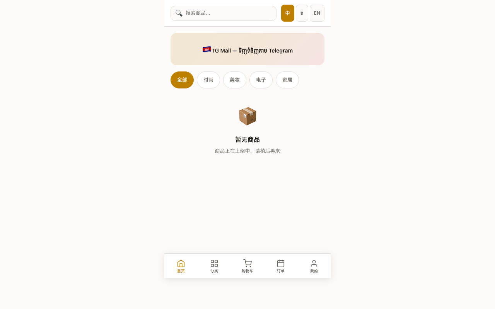
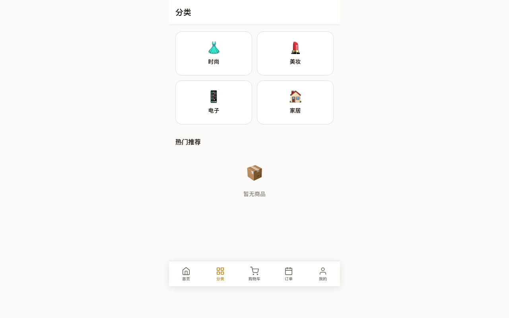
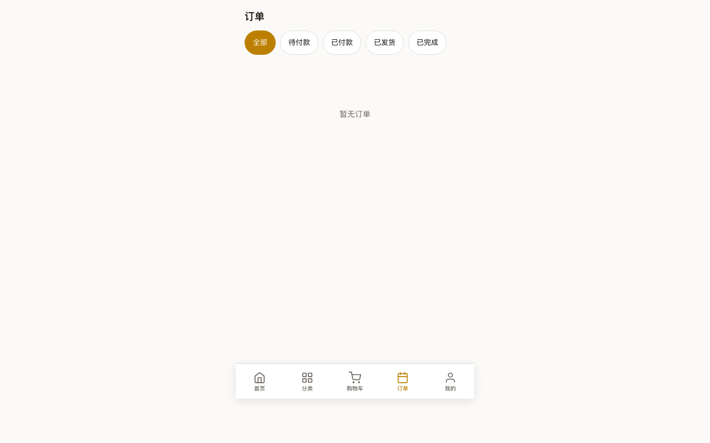
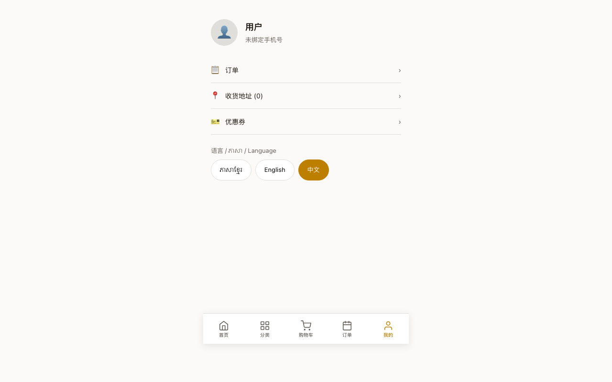
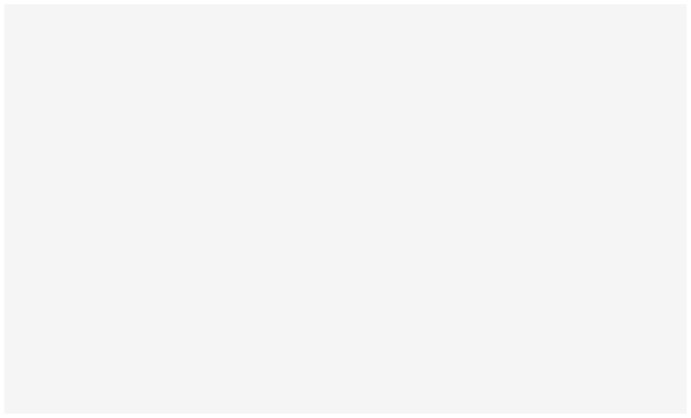

# TG Mall 用户操作手册 (V2)

## 柬埔寨 Telegram 电商平台 — 公司自营版

> **文档版本**：V2.0
> **编制日期**：2026 年 6 月 7 日
> **系统地址**：https://tgmall-production.up.railway.app

---

## 目录

1. [消费者操作指南](#一消费者操作指南)
2. [管理后台操作指南](#二管理后台操作指南)
3. [常见问题](#三常见问题)

---

## 一、消费者操作指南

### 1.1 进入商城

在 **Telegram** 中搜索 **@xhzmall_bot**，点击底部「🛒 ចូលទៅហាង」按钮进入。

也可以扫描以下链接生成的 QR 码：
```
https://tgmall-production.up.railway.app/go
```

### 1.2 首页浏览



| 区域 | 说明 |
|------|------|
| 顶部搜索栏 | 点击进入搜索 |
| 语言按钮 | **中 / ខ / EN** 切换界面语言 |
| 品类横滑 | 全部 / 时尚 / 美妆 / 电子 / 家居 |
| 商品网格 | 双列展示，无限滚动 |
| 底部导航 | 首页 / 分类 / 购物车 / 订单 / 我的 |

### 1.3 分类浏览



点击底部「分类」→ 4 大品类卡片 → 点击跳转首页自动筛选。

### 1.4 购物流程

1. **浏览商品** → 点击进入详情页
2. **加入购物车** → 可调整数量
3. **去结算** → 选择地址 + 支付方式
4. **提交订单** → 进入支付页面
5. **支付** → KHQR 扫码 / ABA Pay / Wing Pay / COD 货到付款

### 1.5 订单追踪



Tab 切换：全部 / 待付款 / 已确认 / 已付款 / 已发货 / 已完成。

### 1.6 个人中心



| 功能 | 说明 |
|------|------|
| 我的订单 | 查看所有订单 |
| 收货地址 | 管理配送地址 |
| 优惠券 | 领取和查看 |
| 语言设置 | 中 / ភាសាខ្មែរ / English |

---

## 二、管理后台操作指南

### 2.1 登录

浏览器打开：
```
https://tgmall-production.up.railway.app/admin/
```



输入**用户名**和**密码**，点击登录。

> 默认账号：`admin`，密码由管理员在 Railway 环境变量 `ADMIN_PASSWORD` 中设置（bcrypt 哈希）。

### 2.2 商品管理

登录后，左侧菜单 → **商品管理**：

| 操作 | 说明 |
|------|------|
| 查看列表 | 表格展示名称、USD价格、库存、状态 |
| 添加商品 | 填写三语名称/价格/库存/图片，点击发布 |
| 编辑商品 | 点击编辑进入表单 |
| 上/下架 | 开关切换 |

**添加商品字段**：

| 字段 | 说明 |
|------|------|
| 名称 (高棉语) | ឈ្មោះ ជាភាសាខ្មែរ |
| 名称 (英语) | Name in English |
| 名称 (中文) | 名称 (中文) |
| USD 价格 | 美元标价 |
| KHR 价格 | 瑞尔标价 |
| 库存 | 可售件数 |
| 品类 | 时尚/美妆/电子/家居 |
| 图片 | 粘贴图片 URL |

### 2.3 订单管理

左侧菜单 → **订单管理**：

| Tab | 说明 |
|-----|------|
| 全部 | 所有订单 |
| 待付款 | 等待消费者付款 |
| 已确认 | COD 订单，等待发货 |
| 已付款 | 待发货 |
| 已发货 | 运输中 |
| 已完成 | 交易完成 |

**发货操作**：点击已付款订单 → 填写物流公司和运单号 → 确认发货。

### 2.4 数据看板

左侧菜单 → **数据看板**：查看今日收入、待处理订单、7 天趋势图。

### 2.5 用户管理

搜索、查看已注册消费者。

---

## 三、常见问题

| 问题 | 解决 |
|------|------|
| 管理后台白屏 | URL 后加 `?v=2` 绕过 CDN 缓存 |
| 忘记密码 | Railway → Variables → 修改 ADMIN_PASSWORD，重新部署 |
| 商品不显示 | 检查商品状态是否为"上架"、库存 > 0 |
| Mini App 打不开 | 确保在 Telegram App 内打开，非浏览器 |
| 语言切换不生效 | 关闭 Mini App 重新打开 |

---

*TG Mall 团队 · 2026*
