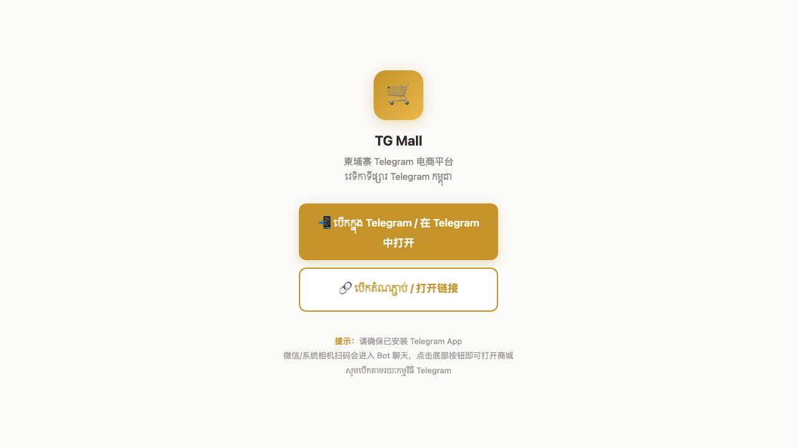
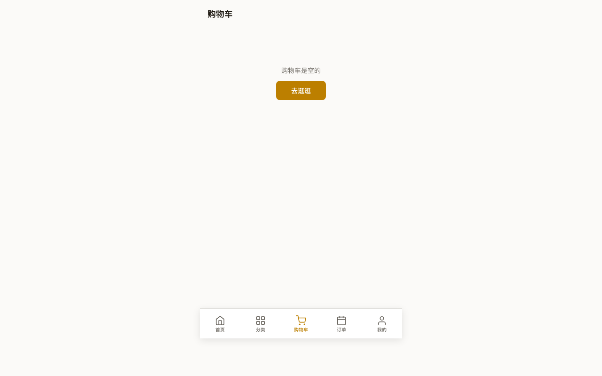

# TG Mall 用户操作手册

## 柬埔寨 Telegram Mini App 电商平台

> **文档版本**：V2.1
> **编制日期**：2026 年 6 月 7 日
> **最新验证**：Playwright 全页面截图（消费者6页 + 商家后台 + 运营后台）
> **更新内容**：Token 复制登录流程、ElementPlus 崩溃修复、Telegram 自动登录
> **适用对象**：消费者、商家、平台运营人员
> **系统地址**：https://tgmall-production.up.railway.app

---

## 目录

- [第一篇：消费者操作指南](#第一篇消费者操作指南)
  - [1.1 如何进入 TG Mall](#11-如何进入-tg-mall)
  - [1.2 浏览首页与商品](#12-浏览首页与商品)
  - [1.3 切换语言（中/柬/英）](#13-切换语言中柬英)
  - [1.4 分类浏览商品](#14-分类浏览商品)
  - [1.5 搜索商品](#15-搜索商品)
  - [1.6 查看商品详情](#16-查看商品详情)
  - [1.7 购物车操作](#17-购物车操作)
  - [1.8 下单与结算](#18-下单与结算)
  - [1.9 支付方式](#19-支付方式)
  - [1.10 管理收货地址](#110-管理收货地址)
  - [1.11 查看订单与追踪物流](#111-查看订单与追踪物流)
  - [1.12 取消订单](#112-取消订单)
  - [1.13 确认收货](#113-确认收货)
  - [1.14 领取优惠券](#114-领取优惠券)
  - [1.15 个人中心与设置](#115-个人中心与设置)
- [第二篇：商家操作指南](#第二篇商家操作指南)
  - [2.1 商家入驻申请](#21-商家入驻申请)
  - [2.2 登录商家后台](#22-登录商家后台)
  - [2.3 商品管理（上架/编辑/下架）](#23-商品管理上架编辑下架)
  - [2.4 订单处理与发货](#24-订单处理与发货)
  - [2.5 数据看板](#25-数据看板)
  - [2.6 生成店铺二维码](#26-生成店铺二维码)
- [第三篇：平台运营操作指南](#第三篇平台运营操作指南)
  - [3.1 登录运营后台](#31-登录运营后台)
  - [3.2 审核商家入驻](#32-审核商家入驻)
  - [3.3 查看平台大盘数据](#33-查看平台大盘数据)
  - [3.4 系统配置管理](#34-系统配置管理)
  - [3.5 用户管理](#35-用户管理)
- [第四篇：通用功能](#第四篇通用功能)
  - [4.1 多语言支持说明](#41-多语言支持说明)
  - [4.2 双币种价格显示](#42-双币种价格显示)
  - [4.3 Telegram Bot 通知说明](#43-telegram-bot-通知说明)
  - [4.4 弱网环境使用建议](#44-弱网环境使用建议)
- [第五篇：常见问题与故障排除](#第五篇常见问题与故障排除)

---

## 第一篇：消费者操作指南

> **适用角色**：所有在 TG Mall 上购物的用户
> **使用设备**：智能手机（Telegram App 内打开）

### 1.1 如何进入 TG Mall

TG Mall 是 Telegram 内嵌小程序，有 **4 种进入方式**：

| 方式 | 操作步骤 | 体验 |
|------|----------|------|
| **扫码进入** | 用 Telegram 扫一扫功能扫描 TG Mall 二维码 | ⭐ 最佳，直接进入商城 |
| **Bot 菜单** | Telegram 搜索 @xhzmall_bot → 点击底部"🛒 ចូលទៅហាង"按钮 | 正常 |
| **落地页** | 浏览器打开 `https://tgmall-production.up.railway.app/go` → 自动跳转 Telegram | 兼容微信扫码 |
| **直接链接** | Telegram 中点击 `https://t.me/xhzmall_bot` | Fallback |

#### 各入口详情

**方式一：Telegram 内扫码（推荐）**

1. 打开 Telegram App
2. 进入任意聊天 → 点击输入框旁的"附件"图标 → 选择"Scan QR"
3. 对准 TG Mall 二维码扫描
4. 自动进入 Mini App 商城首页

**方式二：Bot 底部菜单按钮**

打开 @xhzmall_bot 后，底部输入框旁会有一个固定按钮：

```
┌─────────────────────────────────┐
│  🛒 ចូលទៅហាង  ← 点击即可进入        │
└─────────────────────────────────┘
```

**方式三：落地页链接**

微信/系统相机扫码后，会打开引导页。在引导页点击"在 Telegram 中打开"，自动跳转到商城。



**方式四：Bot 命令**

在 @xhzmall_bot 聊天中输入以下命令：
- `/start` — 开始使用
- `/shop` — 打开商城
- `/orders` — 查看我的订单

---

### 1.2 浏览首页与商品

进入 TG Mall 后，首页结构如下：


**页面结构（从上到下）**：

| 区域 | 功能 |
|------|------|
| **顶部搜索栏** | 点击进入搜索页面，搜索商品 |
| **语言切换按钮** | 中 / ខ / EN 三个按钮，切换界面语言 |
| **Banner 区** | 平台活动推广图 |
| **品类横滑栏** | 全部 / 时尚 / 美妆 / 电子 / 家居，点击筛选品类 |
| **商品双列网格** | 商品卡片瀑布流，显示缩略图、名称、USD价格、KHR价格 |
| **底部导航栏** | 首页 / 分类 / 购物车 / 订单 / 我的 |

**商品卡片展示信息**：
- 商品主图（占卡片 60% 面积）
- 商品名称（当前语言）
- USD 价格（大字醒目）
- KHR 价格（小字灰色）
- 商家名称

**页面交互**：
- **下拉刷新**：在页面顶部下拉可重新加载商品
- **无限滚动**：滚动到底部自动加载更多商品
- **点击商品**：进入商品详情页

---

### 1.3 切换语言（中/柬/英）

首页右上角有三个语言切换按钮：

```
┌────────┬─────┬──────┐
│   中   │  ខ  │  EN  │
└────────┴─────┴──────┘
```

| 按钮 | 语言 | 说明 |
|------|------|------|
| **中** | 中文 | 默认显示语言，面向华人用户 |
| **ខ** | ភាសាខ្មែរ（高棉语） | 本地默认语言，柬埔寨官方语言 |
| **EN** | English | 国际用户和游客 |

点击对应按钮即可切换语言，**所有界面文字即时更新**，无需刷新。


> **提示**：切换语言后商品列表会重新加载，商品名称以所选语言显示。

---

### 1.4 分类浏览商品

点击底部导航栏的**"分类"**（Shop）图标进入分类页面：


**分类页面结构**：

| 区域 | 内容 |
|------|------|
| **分类网格** | 4 大类目卡片，2 列布局 |
| **热门推荐** | 下方展示人气商品列表 |

**四大品类**：

| 品类 | 图标 | 英文 | 高棉语 |
|------|------|------|--------|
| 时尚 | 👗 | Fashion | សំលៀក |
| 美妆 | 💄 | Beauty | សម្រស់ |
| 电子 | 📱 | Electronics | អេឡិចត្រូនិច |
| 家居 | 🏠 | Home | គ្រឿងសង្ហារិម |

点击任一分品卡片 → 跳转首页并自动筛选该品类商品。

---

### 1.5 搜索商品

从首页或分类页点击顶部搜索栏进入搜索页面：

*(搜索页：点击首页搜索栏进入，支持高棉语/中文/英文搜索)*

**搜索支持**：
- **高棉语搜索**：输入 `ខោអាវ`（衣服）
- **中文搜索**：输入 `连衣裙`
- **英文搜索**：输入 `dress`

**功能**：
- 300ms 防抖，输入停止后自动搜索
- 历史搜索记录（最近 10 条）
- 热门搜索词推荐
- 搜索结果以双列网格展示

**无结果时**：显示"— 未找到相关商品 —"（三语）并推荐热门品类。

---

### 1.6 查看商品详情

点击任意商品卡片进入商品详情页：

**商品详情页包含**：
1. **图片轮播区**：左右滑动浏览多张商品图片，点击放大全屏查看
2. **规格选择区**：如有颜色/尺码等规格，以按钮组展示，选中后联动价格和库存
3. **商品信息**：名称（当前语言）、双币种价格、商家名称
4. **商品描述**：三语 Tab 切换（高棉语 / English / 中文）
5. **数量选择**：+/- 按钮调节，最小 1，最大为库存数
6. **底部操作栏**："加入购物车"（左侧）+ "立即购买"（右侧）

**售罄状态**：无库存时按钮灰显并显示"售罄"（三语）。

---

### 1.7 购物车操作

点击底部导航栏的**"购物车"**（Cart）图标进入：



**购物车功能**：

| 操作 | 说明 |
|------|------|
| **按商家分组** | 同一商家商品归为一组 |
| **全选/单选** | 每组有全选框，每件商品有单选框 |
| **修改数量** | 点击 +/- 按钮增减数量 |
| **删除商品** | 点击删除按钮移除商品 |
| **库存校验** | 自动校验库存，不足时标红提示 |

**底部结算栏**：
- 左侧：全选/全不选
- 中间：选中商品合计金额（USD + KHR）
- 右侧："结算(N)"按钮 —— N 为选中商品数

**空购物车时**：显示"— 购物车是空的 —"（三语）+ "去逛逛"按钮。

**数据持久化**：购物车数据同步到后端，登录后换设备不会丢失。

---

### 1.8 下单与结算

在购物车勾选要购买的商品 → 点击"结算"按钮进入结算页面：

**结算页结构**：

| 步骤 | 说明 |
|------|------|
| **① 收货地址** | 显示默认地址，可点击更换或新增 |
| **② 商品清单** | 确认购买的商品、数量、单价 |
| **③ 优惠券** | 选择可用优惠券（自动计算最优券） |
| **④ 支付方式** | 选择 KHQR / ABA Pay / Wing Pay / COD |
| **⑤ 价格明细** | 小计 — 优惠券抵扣 — 配送费 = 实付金额 |
| **⑥ 提交订单** | 点击提交，跳转支付页面 |

**校验规则**：
- 必须选择收货地址
- 库存不足商品会被标记，无法提交
- 超过 $100 的 COD 订单会提示"建议使用在线支付"

---

### 1.9 支付方式

提交订单后进入支付页面。TG Mall 支持 **4 种支付方式**：

| 支付方式 | 说明 | 到账速度 |
|----------|------|----------|
| **KHQR 扫码** | 柬埔寨通用扫码支付（ABA/ACLEDA/Wing 等银行 App 都支持） | 即时 |
| **ABA Pay** | 柬埔寨最流行的电子钱包 | 即时 |
| **Wing Pay** | Wing 银行电子支付 | 即时 |
| **COD 货到付款** | 收到商品后再付款 | — |

#### KHQR 支付流程

1. 支付页显示 KHQR 二维码
2. 用银行 App（ABA Mobile / ACLEDA Mobile 等）扫码
3. 确认金额后输入 PIN 完成支付
4. 支付成功自动跳转到"支付成功"页面

> ⏱️ 支付有效期为 **15 分钟**，超时后订单自动取消。

#### COD 货到付款

- 适合不确定商品质量的首次购买
- 金额超过 $100 会友情提示
- 收货时向配送员付款

---

### 1.10 管理收货地址

进入**个人中心** → 点击"收货地址"展开：


**地址管理功能**：

| 操作 | 说明 |
|------|------|
| **添加地址** | 填写收件人、手机号（+855）、省份、区/县、详细地址 |
| **设为默认** | 勾选"设为默认"，下单时自动选择 |
| **编辑地址** | 点击地址进入编辑模式 |
| **删除地址** | 左滑删除（需确认） |

**限制**：最多保存 10 个地址。

**手机号格式**：必须为 +855 开头的柬埔寨手机号（支持 Cellcard / Smart / Metfone 号段）。

---

### 1.11 查看订单与追踪物流

点击底部导航栏的**"订单"**（Orders）图标进入：


**订单状态 Tab**：

| Tab | 中文 | 高棉语 | 英文 |
|-----|------|--------|------|
| 全部 | 全部 | ទាំងអស់ | All |
| 待付款 | 待付款 | រង់ចាំ | Pending |
| 已付款 | 已付款 | បានបង់ | Paid |
| 已发货 | 已发货 | បានដឹក | Shipped |
| 已完成 | 已完成 | បញ្ចប់ | Completed |

**订单卡片信息**：
- 订单号（ORD-YYYYMMDD-XXXXXX）
- 商品缩略图 + 商家名称
- 商品件数
- 金额（USD）
- 订单状态标签（彩色）
- 下单时间

**订单详情页**：
- 订单状态进度条（当前状态高亮）
- 完整商品清单
- 收货地址
- 支付方式
- 价格明细
- 物流信息（已发货状态）
- 操作按钮（去支付 / 确认收货 / 取消订单）

**状态标签颜色**：

| 状态 | 颜色 | 含义 |
|------|------|------|
| 待付款 | 🟡 金色 | 等待消费者付款 |
| 已付款 | 🔵 蓝色 | 等待商家发货 |
| 已发货 | 🟢 绿色 | 商品在运输中 |
| 已完成 | ⚪ 灰色 | 交易完成 |
| 已取消 | 🔴 红色 | 订单已取消 |

---

### 1.12 取消订单

**可取消条件**：仅**待付款**状态的订单可以取消。

**操作步骤**：
1. 进入订单详情
2. 点击"取消订单"按钮
3. 确认弹窗："确定要取消此订单吗？"（三语）
4. 确认后订单状态变为"已取消"

**取消后自动处理**：
- 商品库存恢复
- 已使用的优惠券退还
- 15 分钟未付款的订单系统会自动取消

---

### 1.13 确认收货

收到商品后需要确认收货完成交易：

1. 进入"已发货"状态的订单详情
2. 点击"确认收货"按钮
3. 确认后订单状态变为"已完成"

**自动确认**：发货后 **7 天**未手动确认，系统自动确认收货。

---

### 1.14 领取优惠券

进入**个人中心** → 点击"优惠券" → 进入优惠券中心：

**可领取列表**：浏览平台发放的优惠券，点击"立即领取"。

**优惠券类型**：

| 类型 | 说明 | 示例 |
|------|------|------|
| 满减券 | 满 X 元减 Y 元 | 满 $10 减 $2 |
| 折扣券 | 折扣百分比 | 全单 9 折 |
| 免邮券 | 免配送费 | 免运费 |

**我的优惠券**：查看已领取的券，Tab 分类：未使用 / 已使用 / 已过期。

---

### 1.15 个人中心与设置


**个人中心功能清单**：

| 功能 | 说明 |
|------|------|
| **用户信息** | Telegram 头像、昵称、绑定手机号 |
| **我的订单** | 查看所有订单 |
| **收货地址** | 管理配送地址 |
| **优惠券** | 领取和查看优惠券 |
| **语言设置** | 切换 中/柬/英 界面语言 |
| **🔑 商家后台 Token** | 显示当前 Token（遮罩），点击 **复制** 后粘贴到商家/运营后台登录 |
| **语言设置** | 切换 中/柬/英 界面语言 |
| **退出登录** | 清除本地 Token |

> 📋 **Token 用途**：复制此 Token 后粘贴到 `https://...railway.app/merchant/` 或 `/admin/` 的登录框，即可登录商家后台或运营后台。

---

## 第二篇：商家操作指南

> **适用角色**：在 TG Mall 上开店的商家
> **使用设备**：手机 + 电脑（商家后台为 Web 页面）

### 2.1 商家入驻申请

**Step 1：提交申请**

访问商家后台网页：`https://tgmall-production.up.railway.app/merchant/`

填写入驻表单：

| 字段 | 说明 | 必填 |
|------|------|------|
| 店铺名称（高棉语） | ឈ្មោះហាង | ✅ 必填 |
| 店铺名称（英语） | Shop Name | ✅ 必填 |
| 老板姓名 | Owner Name | ✅ 必填 |
| 手机号 | +855 格式 | ✅ 必填 |
| 详细地址 | អាសយដ្ឋាន | ✅ 必填 |
| 主营品类 | 下拉选择（时尚/美妆/电子/家居） | ✅ 必填 |
| 店铺简介 | 选填 | 选填 |

**表单语言**：支持三语切换填写。

**手机号校验**：实时检查 +855 格式和运营商号段。

**提交后**：
- 显示"申请已提交，预计 1-3 个工作日内审核"
- 平台运营收到 Telegram Bot 通知："[新入驻申请] {店铺名称} 申请入驻"
- 审核结果通过 Telegram Bot 通知发送给商家

---

### 2.2 登录商家后台

登录需要 **JWT Token**，获取方式如下：

**Step 1**：手机打开 Telegram，搜索 @xhzmall_bot
**Step 2**：点击底部菜单「🛒 ចូលទៅហាង」进入商城 → 进入「我的」页面
**Step 3**：点击 Token 栏旁边的 **「复制」** 按钮
**Step 4**：把 Token 发送到电脑（Telegram 草稿箱 / 微信 发给文件传输助手）
**Step 5**：浏览器打开 `https://tgmall-production.up.railway.app/merchant/`
**Step 6**：粘贴 Token → 点击「商家登录」

> 💡 Token 获取路径：**Mini App → 我的 → 复制 Token**
>
> ⚠️ 只有审核通过（status=active）的商家可以登录。如未入驻，请先在 Mini App 中提交商家申请。


---

### 2.3 商品管理（上架/编辑/下架）

登录后进入商品管理页面：

**添加商品**：

| 字段 | 说明 | 格式 |
|------|------|------|
| 商品名称 | 三语（高棉语必填 / 英语必填 / 中文选填） | 纯文本 |
| 商品描述 | 三语（高棉语必填 / 英语必填 / 中文选填） | 支持富文本 |
| USD 价格 | 美元标价 | 数字，保留两位小数 |
| KHR 价格 | 瑞尔标价（USD × 汇率四舍五入到百位） | 整数 |
| 库存数量 | 可售件数 | 整数 |
| 品类 | 下拉选择 | 时尚/美妆/电子/家居 |
| 商品图片 | 支持拖拽上传，最多 9 张 | JPG/PNG/WebP，≤ 5MB |
| 规格（可选） | 颜色/尺码等 | JSON 格式 |
| 上架状态 | 立即上架 / 保存为草稿 | 单选 |

**图片上传规则**：
- 支持 JPG、PNG、WebP 格式
- 单张 ≤ 5MB
- 自动压缩（短边 800px）+ 生成 WebP 副本
- 通过 CDN 分发加速

**商品状态流转**：

```
草稿(draft) → 上架(active) → 下架(inactive) → 售罄(sold_out)
```

**编辑商品**：点击编辑进入预填充表单，修改后保存。

**下架商品**：点击下架 → 确认 → 消费者端 5 分钟内不可见。

---

### 2.4 订单处理与发货

**订单管理页面**：

- **Tab 筛选**：全部 / 待付款 / 已付款 / 已发货 / 已完成
- **日期筛选**：按时间范围查看
- **搜索**：按订单号 / 收货人姓名搜索

**发货操作**：

1. 找到状态为"已付款"的订单
2. 点击"确认发货"
3. 弹窗选择物流公司 + 输入运单号
4. 确认发货

**物流公司选项**：
- J&T Express
- DHL Express
- Kerry Express
- 柬埔寨邮政

**发货后自动操作**：
- 订单状态变为"已发货"
- 消费者收到 Bot 通知（含物流公司和运单号）
- 7 天后未确认收货自动完成

---

### 2.5 数据看板

商家后台首页为数据看板：

| 卡片 | 展示数据 |
|------|----------|
| **今日数据** | 今日订单数、销售额（USD+KHR）、待处理订单数（红色角标） |
| **趋势图** | 近 7 天 / 30 天销售额和订单量折线图 |
| **热销榜** | TOP 10 商品销量排行 |
| **订单分布** | 订单状态饼图 |

**空数据状态**：新商家无数据时显示引导"上架您的第一件商品吧！"。

---

### 2.6 生成店铺二维码

商家可以生成专属推广二维码：

1. 进入商家后台 → 推广工具
2. 输入追踪参数（如 `shop_{商家ID}`）
3. 点击生成 QR 码
4. 下载图片后打印贴在店铺门口或传单上

**QR 码链接格式**：
```
https://tgmall-production.up.railway.app/go?ref=shop_{商家ID}
```

扫码后自动进入 TG Mall 并追踪来源。

---

## 第三篇：平台运营操作指南

> **适用角色**：平台运营团队
> **使用设备**：电脑（Web 后台）
> **访问地址**：`https://tgmall-production.up.railway.app/admin/`

### 3.1 登录运营后台

登录方式与商家后台相同：

1. 在 Mini App「我的」页面复制 Token
2. 浏览器打开 `https://tgmall-production.up.railway.app/admin/`
3. 粘贴 Token → 点击「管理员登录」

> ⚠️ 仅 `ADMIN_TELEGRAM_IDS` 白名单中的 Telegram ID 可以登录运营后台。非管理员会提示"权限不足"。


---

### 3.2 审核商家入驻

当有新商家提交入驻申请时，运营人员会收到 Bot 通知。

**审核操作**：

1. 进入"商家审核"页面
2. Tab 切换：待审核 / 已通过 / 已驳回
3. 点击查看商家详情（所有提交信息）
4. 审核决策：

| 操作 | 说明 | 后续动作 |
|------|------|----------|
| **通过** | 设置佣金率（默认 3%），点击"通过" | 自动发 Bot 通知给商家："🎉 恭喜！您的店铺审核已通过！" |
| **驳回** | 填写驳回原因（支持三语） | 自动发 Bot 通知："您的店铺审核未通过。原因：{原因}。请修改后重新提交" |

**已通过商家管理**：可查看、暂停、恢复已通过商家。

---

### 3.3 查看平台大盘数据

运营后台首页展示全局数据：

**核心指标卡片**：

| 指标 | 说明 |
|------|------|
| 订单量 | 今日 / 昨日对比 |
| GMV（交易总额） | USD + KHR |
| 新增用户数 | 今日新增 |
| 新增商家数 | 今日新增 |
| 支付成功率 | 成功支付 / 总订单 |

**趋势图**：
- 近 7 天 / 30 天订单量趋势
- 近 7 天 / 30 天 GMV 趋势
- 支付成功率趋势

**商户排行**：TOP 20 商家按销售额排行

**品类分析**：各品类 GMV 占比饼图

**数据延迟**：≤ 5 分钟刷新

---

### 3.4 系统配置管理

**品类管理**：
- 新增 / 编辑 / 启用 / 禁用商品品类
- 名称支持三语
- 设置品类图标

**佣金率设置**：
- 默认佣金率（如 3%）
- 支持按品类设置不同佣金率

**Banner 管理**：
- 上传 / 替换首页 Banner 图
- 设置跳转链接
- 拖拽排序

**热门搜索词**：
- 配置搜索页热门搜索标签

**生效方式**：配置修改后即时生效（自动清除对应缓存）。

---

### 3.5 用户管理

**用户列表**：搜索（用户名 / 手机号 / Telegram ID）+ 分页展示。

**用户详情**：注册时间、订单数、消费总额、账号状态。

**禁用/解禁**：
- 禁用后该用户无法下单
- Mini App 显示"账号已被限制"
- 操作记录到日志

---

## 第四篇：通用功能

### 4.1 多语言支持说明

TG Mall 全平台支持 **三种语言**：

| 语言 | 代码 | 适用人群 | 覆盖率 |
|------|------|----------|--------|
| ភាសាខ្មែរ（高棉语） | km | 柬埔寨本地用户 | 100% |
| English | en | 国际用户、游客 | 100% |
| 中文 | zh | 华人用户、中国游客 | 100% |

**语言切换位置**：
- 消费者端：首页右上角 + 个人中心底部
- 商家后台：页面顶部
- 运营后台：页面顶部

**生效范围**：
- 所有页面 UI 文案
- API 错误提示
- Bot 通知消息
- 商品名称（跟随请求头 `Accept-Language`）

---

### 4.2 双币种价格显示

TG Mall 所有价格位置**同时显示两种货币**：

| 币种 | 符号 | 展示方式 | 说明 |
|------|------|----------|------|
| **美元 (USD)** | $ | 大字加粗 | 柬埔寨通用标价货币 |
| **瑞尔 (KHR)** | ៛ | 小字灰色 | 柬埔寨法定货币 |

**显示示例**：
```
$29.99          ← 大字
៛120,000        ← 小字灰色
```

**汇率说明**：
- KHR 价格 = USD 价格 × 当日 Bakong 官方汇率
- 四舍五入到百位
- 汇率每日凌晨自动同步

---

### 4.3 Telegram Bot 通知说明

商家和消费者都会收到 @xhzmall_bot 的 Telegram 消息通知：

**消费者通知**：

| 事件 | 通知内容示例 |
|------|-------------|
| 下单成功 | 🛒 订单已创建！订单号：ORD-xxx，金额：$29.99，请在 15 分钟内完成支付 |
| 支付成功 | ✅ 支付成功！订单号：ORD-xxx，商家将尽快为您发货 |
| 已发货 | 📦 订单已发货！物流公司：J&T Express，运单号：JT123456789 |
| 自动取消 | ⚠️ 订单已超时取消，请重新下单 |

**商家通知**：

| 事件 | 通知内容示例 |
|------|-------------|
| 新订单 | 🔔 新订单！订单号：ORD-xxx，金额：$29.99，请尽快处理 |
| 买家已付款 | 💰 买家已付款！订单号：ORD-xxx，请尽快安排发货 |
| 审核通过 | 🎉 恭喜！您的店铺审核已通过！可以开始上架商品了 |
| 审核驳回 | ❌ 您的店铺审核未通过。原因：{原因} |

**通知语言**：根据用户语言偏好自动选择。

---

### 4.4 弱网环境使用建议

柬埔寨部分区域 3G 网络信号较弱，TG Mall 做了以下优化：

1. **图片懒加载**：图片在滑入视口时才加载
2. **WebP 格式**：体积比 JPG 小 30-50%
3. **CDN 加速**：静态资源通过 CloudFlare 全球节点加速
4. **骨架屏**：数据加载时显示灰色占位图案，非白屏
5. **请求重试**：API 失败自动重试 2 次
6. **离线提示**：完全断网时显示提示页面

**首屏加载时间**：
- 4G 网络：< 3 秒
- 3G 网络：< 5 秒

**建议**：在信号弱区域，等待首页骨架屏加载完成后再滑动浏览。

---

## 第五篇：常见问题与故障排除

### 消费者常见问题

| 问题 | 可能原因 | 解决方法 |
|------|----------|----------|
| 扫码无法进入 | 不是在 Telegram 内扫码 | 用 Telegram 扫一扫功能；或者点落地页的"在 Telegram 中打开" |
| 打开后白屏 | 首次加载较慢 / 网络问题 | 等待 5 秒；下拉刷新；检查网络连接 |
| 语言切换不生效 | 缓存问题 | 多等 2 秒，或关闭 Mini App 重新打开 |
| 商品不显示 | 数据库暂无商品数据 | 这是正常现象，等商家上架后即可显示 |
| 无法下单 | 未添加收货地址 / 商品库存不足 | 先添加地址；检查商品库存提示 |
| 支付超时 | 15 分钟有效期已过 | 重新下单 |
| 没收到 Bot 通知 | 未与 @xhzmall_bot 对话 | 在 Telegram 搜索 @xhzmall_bot 并发送 /start |
| 订单状态不更新 | 网络延迟 | 下拉刷新订单列表 |

### 商家常见问题

| 问题 | 可能原因 | 解决方法 |
|------|----------|----------|
| 无法登录商家后台 | 审核未通过 / 未入驻 | 检查 Telegram 是否有审核通知；先提交入驻申请 |
| 上传图片失败 | 格式不支持 / 超过 5MB | 使用 JPG/PNG/WebP；压缩后重试 |
| 商品已下架但消费者仍可见 | 缓存延迟 | 等 5 分钟缓存过期 |
| 发货后运单号输错了 | 操作失误 | 联系平台运营修改 |

### 平台运营常见问题

| 问题 | 可能原因 | 解决方法 |
|------|----------|----------|
| 数据看板无数据 | 平台刚上线 | 等有真实交易后数据出现，正常现象 |
| 无法登录运营后台 | 不在管理员白名单 | 检查 Railway 环境变量 `ADMIN_TELEGRAM_IDS` |
| 配置修改未生效 | 缓存 | 手动清除对应缓存 |

---

## 附录 A：系统架构简图

```
┌─────────────────────────────────────────────────────┐
│                    Telegram App                      │
│  ┌──────────┐  ┌──────────┐  ┌──────────────────┐  │
│  │ 消费者端  │  │ 商家后台  │  │  运营后台          │  │
│  │ Mini App  │  │ Web App  │  │  Web App          │  │
│  │ / (Vue)  │  │ /merchant│  │  /admin           │  │
│  └────┬─────┘  └────┬─────┘  └────────┬─────────┘  │
│       │             │                 │             │
└───────┼─────────────┼─────────────────┼─────────────┘
        │             │                 │
   ┌────▼─────────────▼─────────────────▼─────┐
   │          Nginx (PORT + 3000)              │
   │   /api/* → Node.js:3001                   │
   │   /go    → Node.js:3001 (落地页)           │
   │   /*     → 静态文件                        │
   └──────────────────┬───────────────────────┘
                      │
              ┌───────▼───────┐
              │ Node.js:3001  │
              │ Express API   │
              └───┬───────┬───┘
                  │       │
          ┌───────▼─┐ ┌──▼──────┐
          │PostgreSQL│ │  Redis  │
          │  数据库   │ │  缓存   │
          └──────────┘ └─────────┘
```

## 附录 B：页面路由表

| 路径 | 页面 | 角色 |
|------|------|------|
| `/` | 首页（商品列表 + 品类筛选） | 消费者 |
| `/category` | 分类页（品类网格 + 热门推荐） | 消费者 |
| `/search` | 搜索页 | 消费者 |
| `/product/:id` | 商品详情 | 消费者 |
| `/cart` | 购物车 | 消费者 |
| `/checkout` | 结算页 | 消费者 |
| `/orders` | 订单列表 | 消费者 |
| `/orders/:id` | 订单详情 | 消费者 |
| `/payment` | 支付页 | 消费者 |
| `/payment/result` | 支付结果 | 消费者 |
| `/profile` | 个人中心 | 消费者 |
| `/coupons` | 优惠券中心 | 消费者 |
| `/go` | 扫码落地页 | 所有 |
| `/api/v1/health` | 健康检查 | 运维 |
| `/merchant/` | 商家后台 | 商家 |
| `/admin/` | 运营后台 | 运营 |

---

*文档由 TG Mall 团队维护，最后更新：2026 年 6 月 7 日。如有疑问请联系 @xhzmall_bot。*
